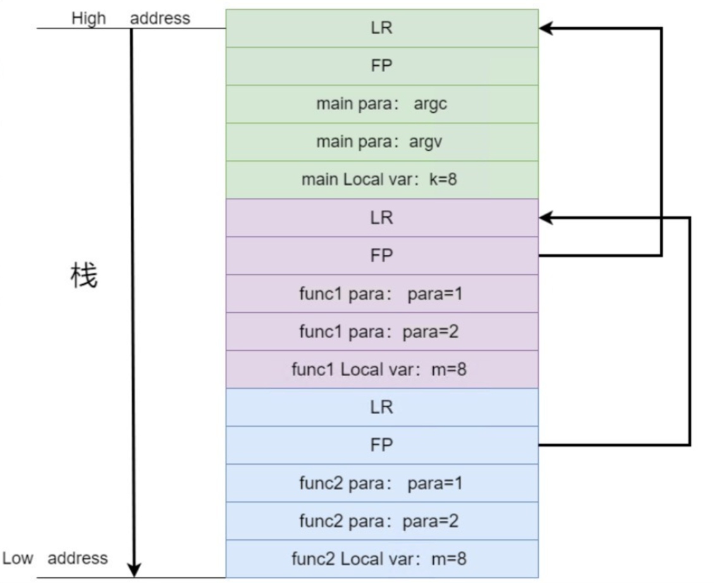
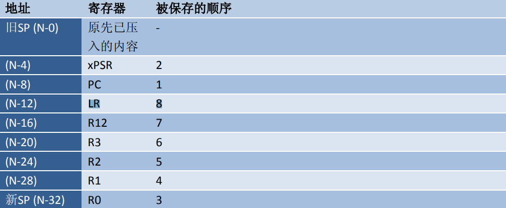
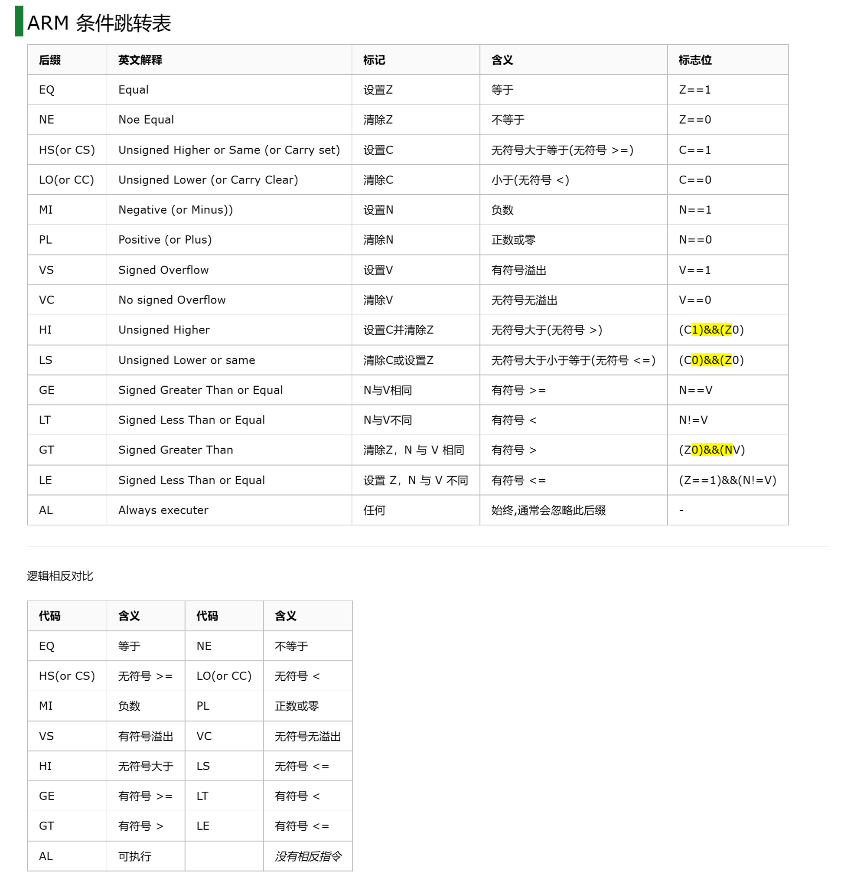
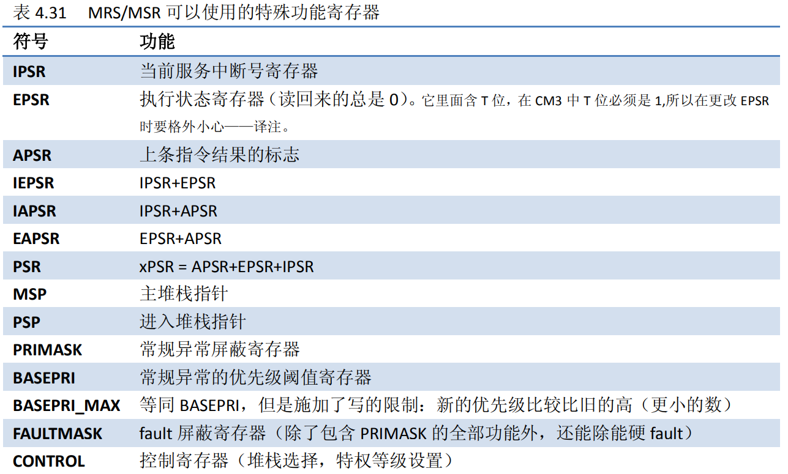
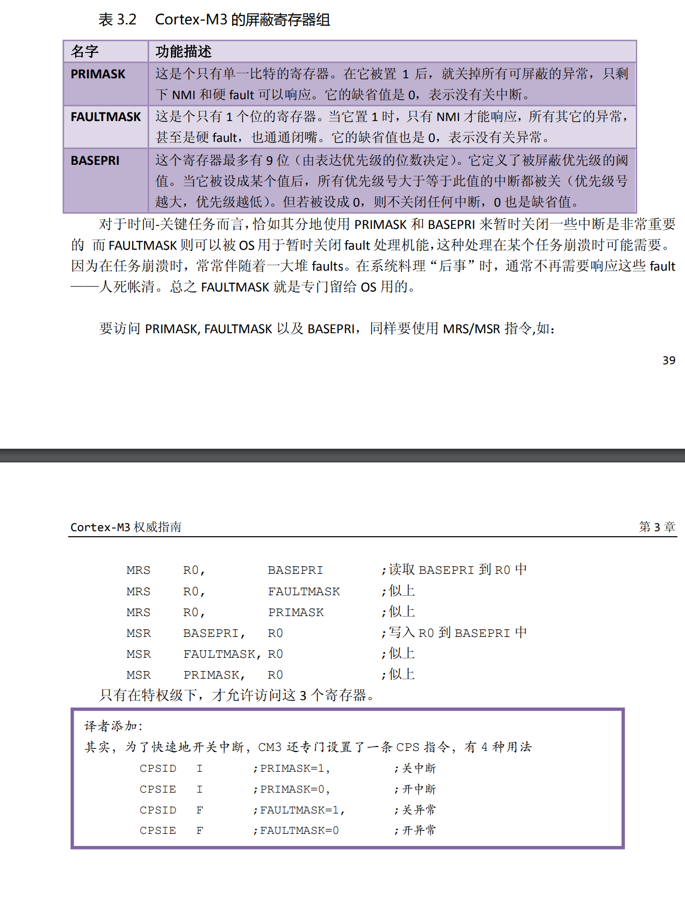
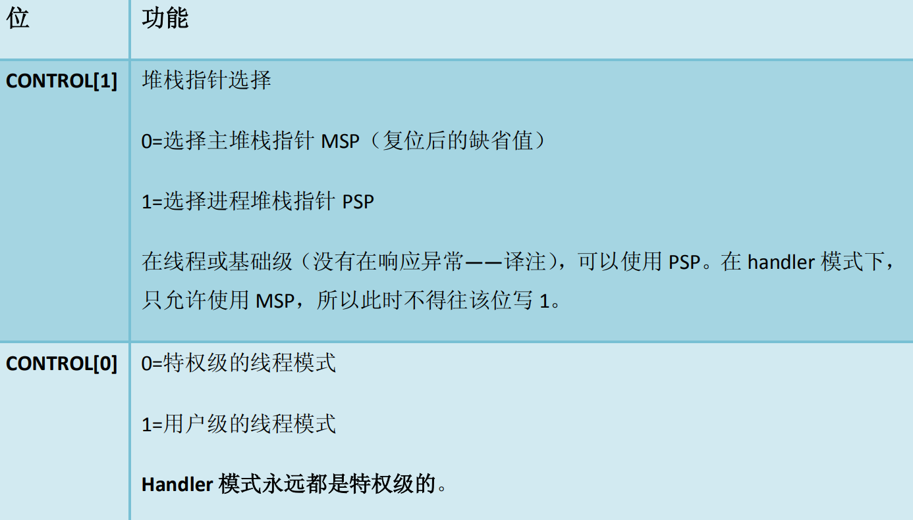
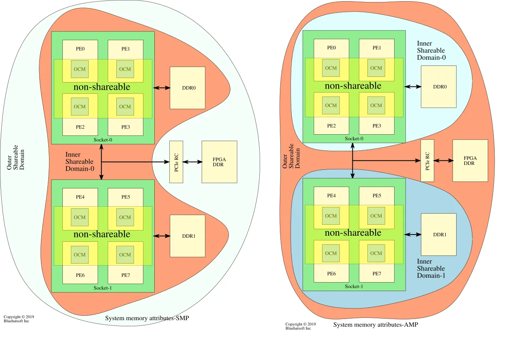
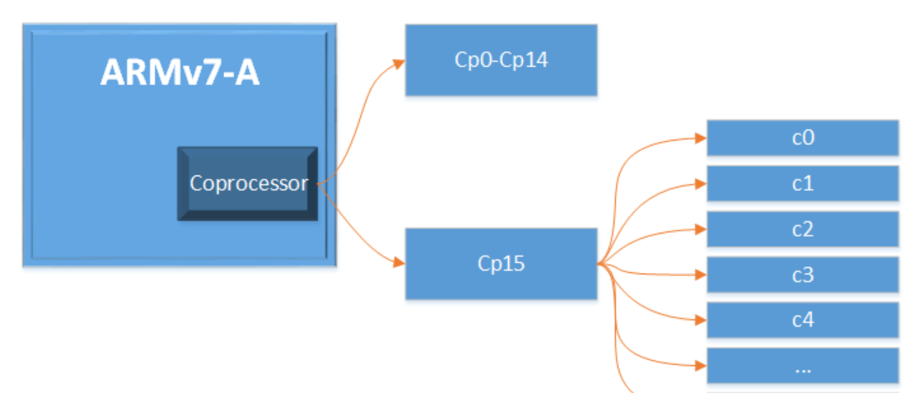
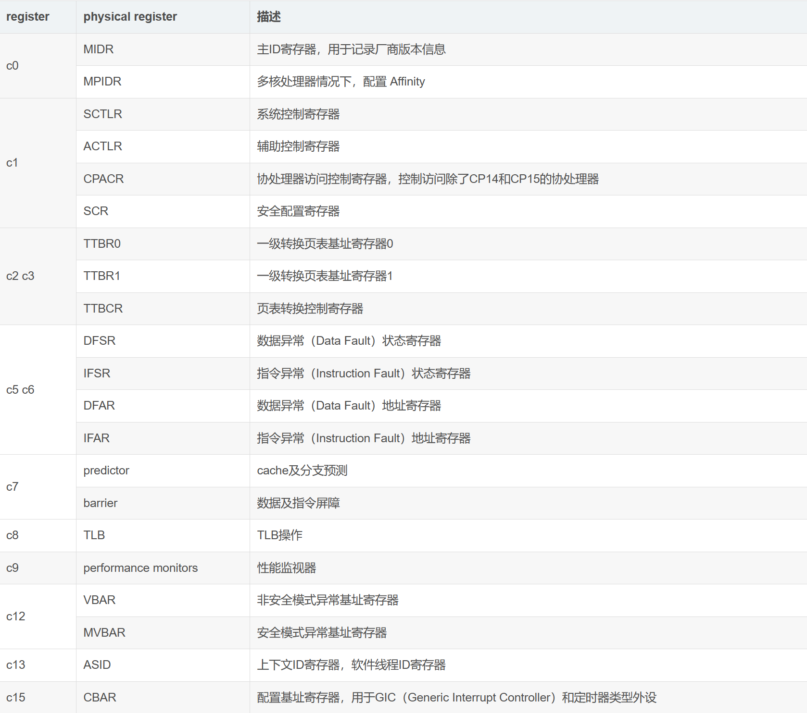
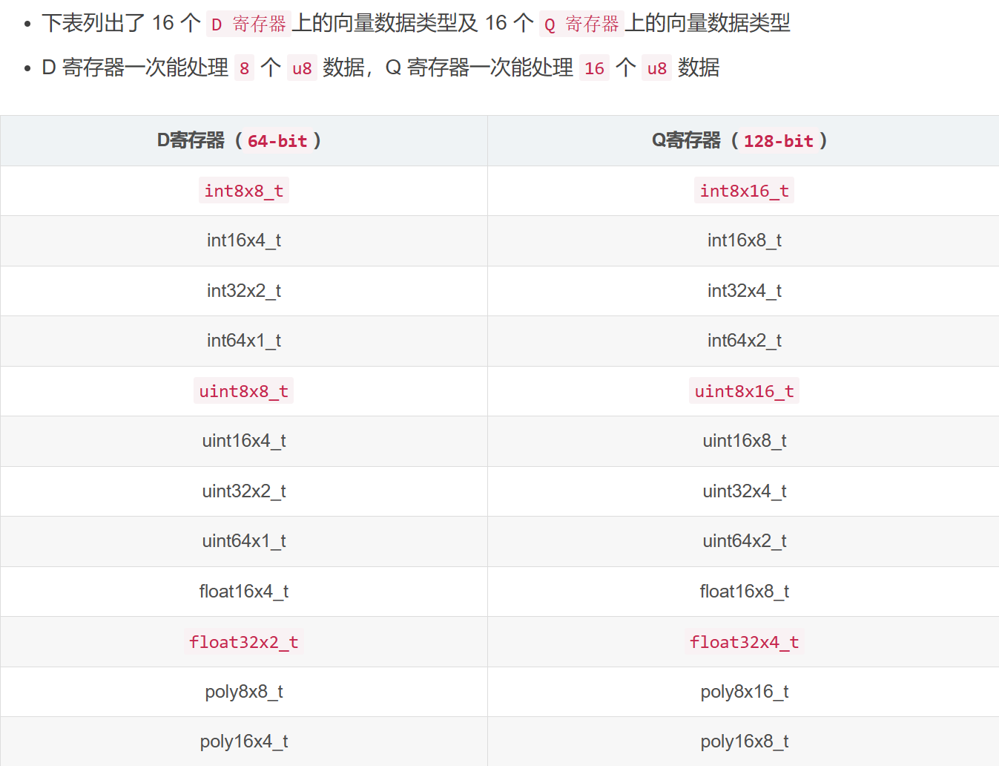

# 通用寄存器

## 功能划分

```assembly
' 以下是ARMv7寄存器的常见用法 '
R0  R1  R2  R3            ; 传参寄存器
R4  R5  R6  R8  R9  R10
R7                        ; syscall number
R11                       ; FP(frame pointer)
R12                       ; IP(Intra Procedural Call)程序内调用
R13                       ; SP
R14                       ; LR
R15                       ; PC (注意thumb下2字节)
                          ; 在执行过程中, PC在ARM状态下存储当前指令地址加8(两条ARM指令)
                          ; 在Thumbv1状态下存储当前指令地址加4(两条Thumb指令)
                          ; 这是由三级流水线决定的, PC提前指向待取指的指令, 等到解码结束后开始执行
; 注意: 当我们直接读取PC / 非调试模式时, 它遵循PC + 8
; 但在调试时, PC指向当前正在执行指令的地址(方便调试)
CPSR

; 对应Intel
R0     -> EAX
R1-R5  -> EBX ECX EDX ESI EDI
R11    -> EBP
R13    -> ESP
R15    -> EIP
CPSR   -> EFLAGS

; armv7中，r0 - r15都是通用寄存器，尤其是r15（PC）
; 这意味着任何能改变寄存器值的指令都有可能导致程序执行分支跳转，分支预测变复杂
; r8 - r14是分组寄存器：Rx_<mode>  <mode>可以是usr、fiq、irq、svc、abt、und

; thumb模式下，r8 - r15不可被访问，但是可以通过SP->R13 | LR->R14 | PC->R15（虽然效果是一样的）
```

## 帧寄存器

> R11 (FP) 用于栈回溯：保存上级栈顶地址（LR），被调用者返回时，**SP = R11**



## 入栈顺序



## 寄存器保存

> 从用户态进入内核态：
> 		进入内核态前，将 R0 - R3, FP, LR 保存到user-stack
> 		进入内核栈后，先保存好一些寄存器（如 LR ...)到当前帧，因为后续还会调用其他帧

## 状态寄存器 CPSR

```assembly
N      Z      C      V  (Reserved)  I      F      T      M4     M3     M2    M1    M0

' 条件标志位 '
N   --->   负 / less than
Z   --->   零
C   --->   进位 / 非借位
           加法运算中 -> c == 1 有进位
           减法运算中(subs/cmp) -> c == 0 有借位
V   --->   溢出
           只有相同符号数相加, 结果符号与原相反才是overflow
           positive + positive / p - n / n + n / n - p ( p + n 则不可能overflow )
; CMP A, B    ->   A-B   -
; TST A, B    ->   A&B    |-> 然后更新标志位
; TEQ A, B    ->   A^B   -

' 状态位 '
;  I  --->   irq禁止
;  F  --->   fiq禁止
;  T  --->   CPU运行状态  1 thumb / 0 arm

' 模式位 '
;  M4 ~ M0
;  1 0000  用户
;  1 1111  内核
;  1 0001  FIQ
;  1 0010  IRQ

```

## 条件码后缀



## ARMv7-m 特性

```assembly
' 栈寄存器 '
; 若指定访问MSP / PSP, 只能在特权模式下, 通过MSR写入 / MRS读取

; MSP : 复位后缺省, 用于内核级线程 & 中断处理程序
; PSP : 用户级线程
;         此时禁止访问系统控制空间SCS ( 0xE000_E000 - )

; 若需指定SP为MSP / PSP, 则通过control[1]
;______________________________________________________
;   .   .   .   .   .   |      1       |      0
;_______________________|______________|_______________
;                       |  0  ->  MSP  |  0  ->  kernel
;        Reserved       |  1  ->  PSP  |  1  ->  user
;_______________________|______________|_______________
;
```

# 指令

## LDR STR

### 加载指令 / 伪指令

```assembly
; 对于arm指令集, 操作指令无法直接操作内存
; 需要先load到寄存器, 再store到内存地址
ldr rx, [ry]
str rx, [ry]
; LDR :  如果源操作数是地址, 汇编器会认出 并置此地址的LSB=1
;       ldr rx, 0x0800_0010   --as->   rx = 0x0800_0011
;       (PS: ADR不会LSB=1, 且ADR无'=',没有伪指令用法
;
;     : 如果源操作数是值, 此时LDR是伪指令
;       ldr rx, =imm
;       如果imm在立即数允许的范围内, 则生成mov / mvn指令. 否则将常量放入附近的'文字池', 用加载指令LDR加载到寄存器 : ldr rx, [pc, #offset]
```

### 索引

```assembly
; 预索引
ldr rx, [ry, #12]! ; 索引发生在传输前 : ry += 12     ldr rx, [ry]
                   ; PS: " ! "表示自增, 如果去掉, 则ry += 12失效
; 后索引
ldr rx, [ry], #12  ; 索引发生在传输后 : ldr rx, [ry]     ry += 12
                   ; PS: #12不能是寄存器, 寄存器提供偏移量时不支持预/后索引, 不过可以 : ldr rx, [ry, rz, lsl #2]
```

### ARM v7提供用于批量高效传输的LDM / STM

```assembly
stm r13, {r4, r5}  
; 默认为 LDMIA / STMIA
    ;r13    //  r13 + 4 = r5
    ;---------------------------
    ;   r4   |   r5   |
    ;---------------------------
; 而 IB
    ;r13    //  r13 + 4 = r4
    ;---------------------------
    ;        |   r4   |   r5
    ;---------------------------
; 而 DA
    ;                         r13
    ;---------------------------
    ;        |   r4   |   r5   |
    ;---------------------------
; 而 DB
    ;                         r13
    ;---------------------------
    ;    r4   |   r5   |       |
    ;---------------------------
; PS: thumb / thumb-2只支持IA / DB

; 而 : stmdb r13!, {r4, r5} 就是 push {r4, r5}
;      ldmia r13!, {r4, r5} 就是 pop  {r4, r5}
; 当然也可以写成stmdb sp!, {r4, r5}
; 其他例 : push {r4-r11, lr}  将r4~r11以及lr(r14)压入栈
```

### 原子操作

```assembly
  ;从armv6开始硬件支持exclusive accesses同步原语(之前是swp, 已弃用)
LDREX Rd, [Rs]  ;---> 标记[Rs]为独占状态
                ; 不过"独占状态"只是一个记号, 如果thread2也LDREX同样的内存地址, 则此独占状态归thread2所有, thread1失去         
STREX Rb, Rd, [Rs] ; 检查[Rs]是否为独占状态
                   ; 是 :   写入后解除[Rs]独占状态, 同时Rb=0
                   ; 否 :   写入失败, Rb=1
CLREX           ; 重置local monitor

; 指定数据大小 : LDREXB(字节)   LDREXH(字 - 默认)   LDREXD(双字)

; LDREX 会让对应的monitor从open变为exclusive
;
;        _________________        _________________
;       |      Core 1     |      |      Core 1     |
;       |  local monitor  |      |  local monitor  |
;        _________________        _________________
;                |           AXI          | 
;                 ------------------------
;                             |
;                       global monitor
;               ______________|______________
;              |            MEMORY           |
```

## 跳转指令

### 代码跳转 B

```assembly
b  1b   ; 往回跳到1处

b  2f   ; 往前跳到2处
```

```assembly
bl  sexy_function
; 带链接地跳转到sexy_function
; LR = PC + 4       B  LR

bx  lr     ; branch exchange
; LR = PC + 4
; arm -> thumb   /   thumb -> arm
; 方便arm code和thumb code的互相调用

blx hahaha
; 众所周知
```

### 分支流转 IT

```
! this is ARMv7-m "feature" (only thumb-2)

; IF-THEN

ITETT EQ   ; 如果cond的Zero位 == 0, 执行
moveq ...
movne ...  ; 若EQ, 执行 1, 3, 4
moveq ...  ;   NE, 执行 2
moveq ...

; 其中, 无论moveq还是movne, 都被压缩成了16bit指令

; PS
; Cortex-M3对条件码后缀有很大的限制, 只有B才能随意使用, 不过引入的IT缓解了一些问题
; IT块中不允许 跳转指令 / CPS / IT
```

> **分支预测** ：
> 	IT block不会引起流水线分支预测
> 	类似if else(C)，由于其汇编依赖于jne(x86) bne(arm)，cpu会预测分支，则有可能导致气泡产生
> **TIPS**：
> ​	后缀 .w 强制指令32bit
> ​	后缀 .n 强制指令16bit
> ​	汇编器默认会试图以16bit编译指令,试图给代码瘦身, 失败则启用32bit

## MSR / MRS





```assembly
MSR control, #0 ; 陷入kernel, with MSP

MSR control, #3 ; 进入user mode, 并使用PSP

MRS r1, msp     ; 读取MSP的值到r1中
```

## SVC

- 监管者调用（SuperVisor Call），由ARMv6及以前的 *SWI*（Software Interrupt）演变而来

```assembly
; ARMv7唯一的软中断 ( 不包括brk断点 / hlt暂停等debug指令)
; 适用于 :  允许一段代码不间断执行 / 从非特权模式->特权模式

SVC  #imm  ; imm :  arm    0 ~ 2^24-1 (24bit)
           ;        thumb  0 ~ 2^8-1  ( 8bit)   ！cm3仅支持, 且svc机器码为0xE92DDF__

; ARM从用户模式正常陷入内核, 只能通过supervisor call
; 通过svc异常进入管理者模式 => 在异常处理程序中切换

;    user
;      |  kernel      CPU DO : LR = PC (用户模式)
;      | /|                    CPSR -> SPSR
;      |/ |                    PC指向中断向量表
;         |     【仅限Cortex-M】push {r0-r3, r12, lr, xPSR, pc} (返回时自动pop)
;         |
;      |\ |           OS  DO : 保存上下文 (pcb) 包括r4-r11
;      | \|                    SPSR -> CPSR
;      |                       PC = LR - 4

```



```assembly
; 获取svc号

通过获取当前svc指令地址( lr - 4 ), 读取到机器指令, 把高8位去除即可

如：

0x0000_0038   EF00_0003        SVC  3
; 进入软中断后：
sw_int:
        mrs r0, psp
        add r1, r0, #24
        ldr r2, [r1]
        sub r3, r2, #2 // thumb
        ldr r0, [r3]
        and r0, r0, #0xFF
        //bic r0, r0, #0xFFFFFF00

        b do_swi

do_swi:
        cmp ry, 0
          DO_WORK_0
        cmp ry, 1
          DO_WORK_1
        ...

; 在 OABI 规范中，系统调用号由 swi(svc) 后的参数指定
; 在 EABI 规范中，系统调用号则由 r7 进行传递，系统调用的参数由寄存器进行传递.
```

## 低功耗模式

- 类似于 x86 的 *pause* 指令，使内核进入 *低功耗模式*, 只能由 *中断* 或 *事件* 唤醒

```assembly
WFI : 常用于CPU IDLE任务

WFE : 
         Core-1请求锁, 上锁并访问资源
                      |
 Core-2请求锁访问同样的资源, 资源已占用, WFE待机
                      |
        Core-1解锁, 调用SEV唤醒所有核心
                      |
        Core-2成功请求锁, 上锁并访问资源

SEV : 改变event register(初始=0), 唤醒所有CPU核心

SEVL : 只唤醒当前核心 (send event locally) # ARMv8 feature

# event register (WFE):
#    if (event register == 0)
#                    该CPU核心进入低功耗状态
#    if (event register == 1)  
#                    该CPU核心不改变状态
```

## 伪指令

```assembly
.align 3   ; 以2^3 = 8字节对齐

.section   ; 标识段 (主要用于自定义的段)
    .section .rodata ; read-only段
    .section .ivt    ; ivt段
    .section .data / .text ; 相当于 .data / .text
    .section .vector, "a", %progbits
        ; a：表示属性 : accessible
        ; b：标识该节包含未初始化的数据（.bss）
        ; d：标识该节包含已初始化的数据（.data）
        ; n：标识该节不包含可执行代码或数据（.note）
        ; r：标识该节包含只读数据（.rodata）
        ; t：标识该节包含可执行代码（.text）

        ; %progbits： 包含程序可执行的指令和数据
        ; %nobits  ： 不包含任何数据或指令
        ; %note    ： 包含一些附加信息（如符号表、重定位信息等）
        ; %debug   ： 包含用于调试的信息（如调试符号表、源代码映射等）
        ; %rel     ： 包含重定位信息，但重定位信息是相对于节中的数据而不是程序的基地址

.arm / .thumb ; 以下代码用arm / thumb编译, 相当于 .code 32 / .code 16
.weak   ; 声明弱符号
.global / .globl   ; 声明全局变量 (对链接器可见)
.local             ; 声明局部变量
.end    ; 汇编结束 (缺省)

.type <name>, <type> ; <type> 可以是 %function / %object
                     ; 常用于arm状态下

.thumb_func ; 标记为thumb函数
.set / .equ ; 赋值
            ;  .equ _start_, 0x7c00
.thumb_set  ; 同.set"起别名"，但会标记为thumb函数的入口
            ; 相当于 .set + .thumb_func

.byte / .short / .word(long) / .quad / .float / .string8(16/32/64)
      variable: .word 0x08000000

.size <name>, .-<name>  ; name函数的大小，当前地址 - name标号地址

.space / .skip
      variable: .space 8, 0x61 ; 给variable分配一块连续的8byte区域, 置为0x61
      
      
; 重复执行
.rpet <次数>
  ...
.endr

; 条件执行
.if <条件>
  ...
.elseif <条件>
  ...
.else
  ...
.endif

; 宏定义
.marco <name> <param>
  ...
.endm
; 类似于#define name(args)  ...
```

## 内联方法

### 输出

```assembly
: "___" (var)
    |
    --> var存放的位置
;  r   允许使用的通用寄存器
;         不指定则按顺序 %0, %1 ...调用
;        可以指定为r4~r11, 如"r8"(114514)
;  m   允许使用地址作为内存操作数
;  g   允许使用任何通用寄存器 / 内存 / 立即整数

"=___"(var)  ; 该操作数可写入,先前的值将被丢弃并被新数据替换
"+___"(var)  ; 可读可写
"&___"(var)  ; 预先clobber, 输入和代码部分不允许使用此操作数
```

### 输入

```assembly
: "___" (val)
    |
    --> val存放的位置
;  r  通用寄存器
;  m  val是有效的内存地址
;  i  val是立即数
# arm
;  l  (Thumb) r0...7
;  h  (Thumb) r8...15
;  f  浮点寄存器 f0...7
;  t  (32bit VFP) s0...31
;  w  (64bit VFP) d0...31
;  k  栈SP

```

### 破坏

```assembly
; 提示编译器 : 这段汇编改变了什么东西

cc       ; 修改了标志寄存器
rx       ; 可能修改了rx寄存器的值
memory   ; 编译器提前将寄存器的值压入内存, 确保内存正确
         ; 使GCC假定块可以任意读取或写入任何内存
         ; GCC将不会对此汇编块重新排序 / 加载 / 存储 
```

### 提到 *volatile*

```assembly
隐式volatile => GCC将没有输出的asm块视为volatile

对GCC而言, "asm volatile不禁止通用指令的重新排序", 它仅防止asm块由于缺乏有意义的副作用而被删除 / 提出循环

;欲使用volatile语义访问volatile对象, 必须将其地址转换为volatile类型的指针, 再通过该指针访问该对象

; 其他 :
;   @ 标识注释行

; __asmeq("%0", "r0") 指示%0使用R0寄存器
```

## 逻辑运算

```assembly
AND ; 按位与

ORR ; 按位或

EOR ; 按位异或 （位反转）

BIC ; 按位清零
```

```assembly
BIC r1, r1, #4

; #4 -> 100,  将r1的第二位清零， 其余不变
```

```assembly
ORR r1, r1, #4

; 将r1的第二位置位
```

```assembly
1. bic BIC指令的格式为： BIC{条件}{S}  目的寄存器，操作数1，操作数2

BIC指令用于清除操作数1的某些位，并把结果放置到目的寄存器中。

操作数1应是一个寄存器， 操作数2可以是一个寄存器、被移位的寄存器、或一个立即数。

操作数2为32位的掩码，如果在 掩码中置了某一位1，则清除这一位。未设置的掩码位保持不变。

 

bic r0,r0,#0x1f

0x1f=11111b

其含义：清除r0的bit[4:0]位。

 

2. orr ORR指令的格式为： ORR{条件}{S}  目的寄存器，操作数1，操作数2

ORR指令用于在两个操作数上进行逻辑戒运算，并把结果放置到目的寄存器中。

操作数1应该是一 个寄存器，操作数2可以是一个寄存器，被移位的寄存器，或一个立即数。

该指令常用于设置操 作数1的某些位。

指令示例： ORR R0，R0，＃3          ；  

该指令设置R0的0、1位，其余位保持不变。  

orr r0,r0,#0xd3    

0xd3=1101 0111    

将r0与0xd3作算数或运算，然后将结果返还给r0,即把r0的bit[7:6]和bit[4]和bit[2:0]置为1。
```

# 屏障

## 编译器barrier

```c
asm volatile ("" ::: "memory");
```

## CPU barrier

```c
DMB   数据存储barrier
;     DMB之后的"内存访问指令(load store..)"不会被CPU重排到DMB之前
;     仅保证DMB前后 内存访问的执行顺序
;     仅影响内存访问 数据cache 和 管理指令

DSB   数据同步barrier
;     DSB前"所有的内存访问指令、高速缓存、分支预测、TLB等"都执行完毕后, 才会执行后面的任何指令

ISB   指令同步barrier
;     ISB会flush流水线, 然后重新从cache / memory中prefetch
;     保证context_switch的效果

>>> CPU barrier的参数 >>>

全系统共享域读写 : SY
  内部共享域读写 : ISH    ; CPU
  外部共享域读写 : OSH    ; DMA
不指定共享域读写 : NSH

; 读 LD  /  写 ST

asm ("dsb ishld" ::: "memory"); 
```



# 协处理器

## 组成

- 由于引入了 MMU、TLB、Cache 等，ARMv7-A 使用协处理器CP0 - CP15来管理这些扩展
- CP0 - CP14用于控制Debug功能、SIMD、浮点...
- CP15称之为系统控制协处理器，旗下寄存器用于管理MMU、TLB、Cache...



- CP15包含 c0 - c15 这些 Primary register，这些 Primary register 并不是物理意义上的寄存器，而是寄存器组，每个都包含物理意义上的寄存器，以下是常用的：



## 初始化

```assembly
CDP P3, 2, C12, C10, C3, 4 ; 完成协处理器P3的初始化
```

## 访问

```assembly
' 加载存储 '
LDC P3, C4, [R0]  ; 将 [R0] 加载到P3的C4寄存器中
STC P3, C4, [R0]  ; 将P3的C4寄存器的数据传送到 [R0]

' 读写 '
; 读
MRC <coprocessor>, <opc1>, <Rn>, <CRx>, <CRy>, <opc2>
    ; 读参数
    coprocessor：访问的协处理器 P0 - P15
    opc1：协处理器执行的操作码 0 - 7；
    Rn：寄存器R0、R1...，将协寄存器的数据读在此寄存器中
    CRx：指定协处理器的目标寄存器
    CRy：协处理器中附加的目标寄存器或者源操作数寄存器，如果不需要附加信息就将CRy设置为C0，否则结果不可预测
    opc2：可选的协处理器特定操作码 0 - 7，不需要时 要设置为0
    ; 例如 : MRC P3, 3, R0, C4, C5, 6

; 写
MCR
```

# 向量扩展

- NEON是一种128位的SIMD扩展指令集

  > 支持包括加法、乘法、比较、移位、绝对值 、极大极小极值运算、保存和加载指令等运算
  > **PS** 下一代SIMD指令集SVE的矢量寄存器的长度最小支持128位，最大可以支持2048位，以128位为增量

- NEON单元主要由四个模块组成
  - NEON Register File
  - 整型执行流水线
  - 单精度浮点执行流水线
  - 数据加载存储和重排流水线

- armv7含有32个64bit（可当作16个128bit）向量寄存器，存放其中的的每个向量元素类型必须相同


## API

- ARM提供了四种使用NEON的方式

  1. 内嵌函数intrinsics

     ```makefile
     API在 arm_neon.h 中，编译选项如下：# 指定浮点协处理器
     
     -mfloat-abi=softfp   -mfpu=neon-vfpv4
     ```

  2. 汇编

  3. 开源库

  4. 编译器自动向量化

     ```makefile
     -fvectorize # 启动自动向量化，-O1及以上生效（-O2以上默认启用）
     ```

## 数据类型

```makefile
<type> <size> x <lanes>_t
#  int8x16_t  ： 16通道的向量，每个通道包含一个int8

<type> <size> x <lanes> x <array_lenth>_t
#  int8x16x4_t： 由4个int8x16_t组成的数组
```


