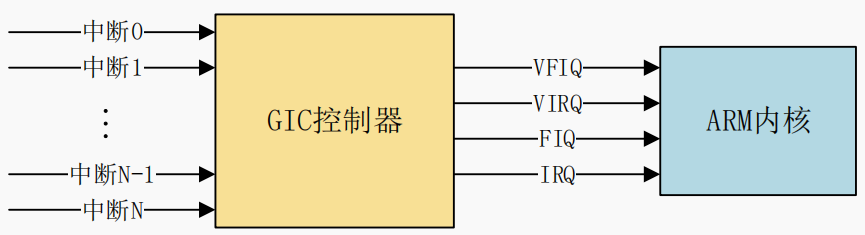
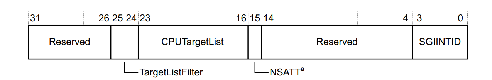
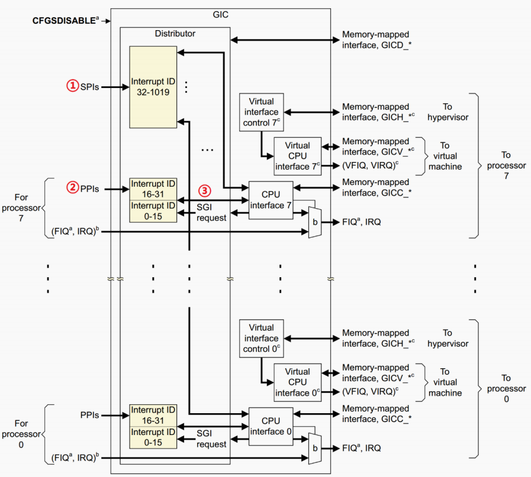
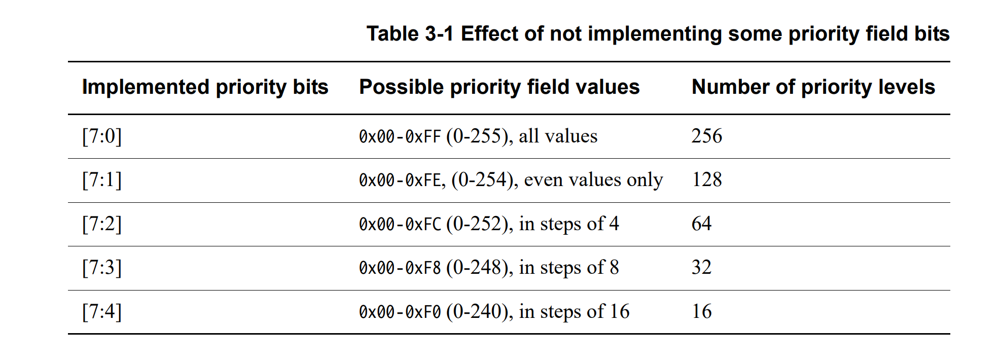
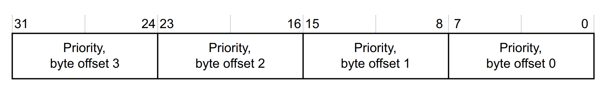
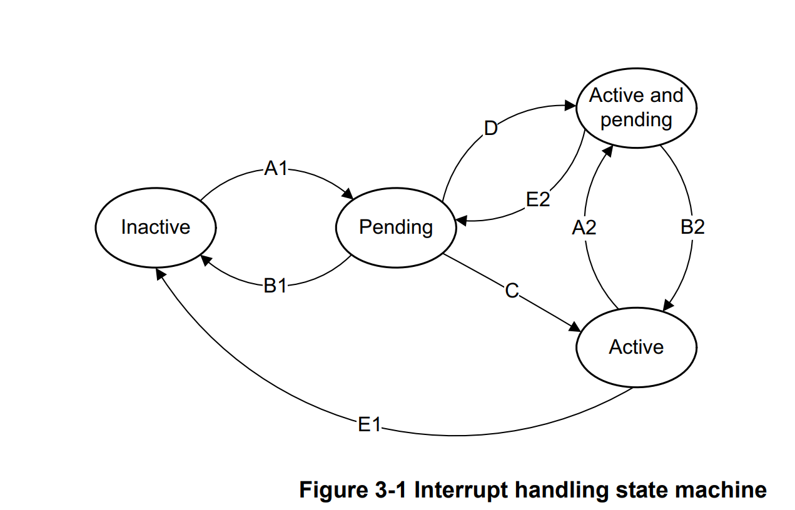

# GICv2

## 总览

- Cortex-A / R 系列的**通用中断控制器**，Cortex-M 系列为 *NVIC*
- GIC 有 *v1 ~ v4* 四个版本，古老的 *v1* 已经被废弃， *v2* 本为  ARMv7 系列处理器设计，但 broadcom 在基于 ARMv8 设计的 bcm2711 与 bcm2712 上依然沿用这一版本 （gic400）
- ARM 依据 GIC 的版本研发相应的 IP 核，半导体厂商直接购买对应的 IP 核即可：gic400 （GICv2）、gic500（GICv3）...

## 框架

- GIC V2 最多支持 8 核，核心代号 0 - 7

- GIC 接收外部中断信号后上报给内核，ARM内核提供四种上报类型：VFIQ 和 VIRQ 针对虚拟化暂不讨论，

  

- GICv2 框架如下图：

  - 左侧为中断源，右侧为向 Cortex内核 发送的中断信号
  
  - 中间部分为 GIC 控制器， GIC 将中断源分为三类：
    - **SGI**（软中断）：软件通过向寄存器 **GICD_SGIR** 写入数据来触发，系统会调起 SGI 中断完成*核间通信*
    
      
    
      1. *TargetListFilter* ：决定 SGI 的处理方式
    
         ```c
         0b00: 按照 CPUTargetList 的指定发送软中断
         0b01: 按照 CPUTargetList 的指定发送软中断，但是不能发送给自己
         0b10: 只发送给自己
         ```
    
      2. *CPUTargetList*：8位分别对应最多8个核心，将某位设置为 1 表示必须将中断转发到此接口，可同时指定多个核心。此选项仅在 *Filter* 为 0b00 时有效
    
      3. *NSATT* ：安全扩展（不必管它
    
      4. *SGIINTID* ：中断 ID 号
    
    - **PPI**（私有外设中断）：来自外设，但 PPI 是核心独有的中断，不共享，如用于进程调度的 *tick*
    
    - **SPI**（共享外设中断）：来自外设，所有核心共享，都可以处理，如*按键中断*、*串口中断*
  
  

## 中断 ID

- GICv2 最多支持 1020 个中断 ID / 每核心，ID号为 0 - 1019，包含 SPI、PPI、SGI，具体分配如下：
  - SGI ：0 - 15
  - PPI ：16 - 31
  - SPI ：32 - 1019，具体的 ID 与中断对应关系由半导体厂商定义

## 中断优先级

- GICv2 支持最小16个，最大256个中断优先级，如下图所示：

  

- 通过 **GICD_IPRIORITYRn** 寄存器设置中断优先级，0 - 7位（byte0）控制 ID 0~3 的中断，依此类推

  

## 状态

- **inactive**：中断处于无效状态

- **pending**：中断处于有效状态，但 CPU 没有响应该中断

- **active **   ：CPU 正在响应该中断

- **active and pending**：正在响应该中断，但是该中断源又发送中断过来了

  

## 触发方式

- edge-triggered：边沿触发
- level-sensitive ：电平触发
