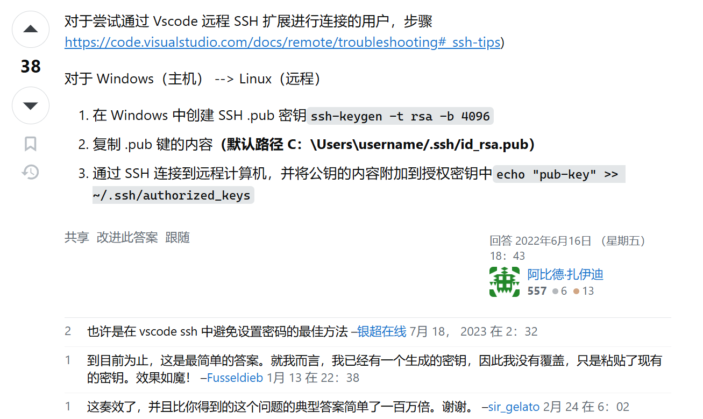
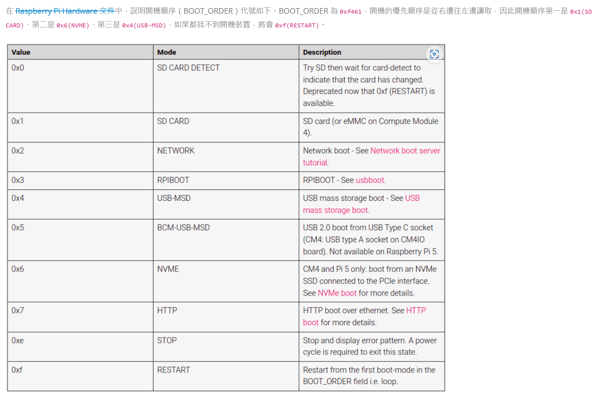

# bash

## 系统

```bash
uname -a  
# Linux ubuntu 5.4.0-1081-raspi #92-Ubuntu SMP PREEMPT Thu Feb 16 10:59:38 UTC 2023 aarch64 aarch64 aarch64 GNU/Linux
cat /proc/version
# Linux version 5.4.0-1081-raspi (buildd@bos01-arm64-012) (gcc version 9.4.0 (Ubuntu 9.4.0-1ubuntu1~20.04.1)) #92-Ubuntu SMP PREEMPT Thu Feb 16 10:59:38 UTC 2023
screenfetch
# 有ubuntu标志的
sudo lscpu
sudo lshw

"包"
sudo apt-cache search aarch64  # 查看和aarch64相关的软件包
sudo dpkg -i xx.deb # 安装软件包

```

## 进程相关

```bash
" 进程 "
ps c     # 精简地显示所有进程
pstree   # 树状结构
ps cux   # 精简的显示进程信息
ps <pid>
'  STAT状态如下
D    uninterruptible sleep (usually IO)
I    Idle kernel thread
R    running or runnable (on run queue)
S    interruptible sleep (waiting for an event to complete)
T    stopped by job control signal
t    stopped by debugger during the tracing
W    paging (not valid since the 2.6.xx kernel)
X    dead (should never be seen)
Z    defunct ("zombie") process, terminated but not reaped by its parent
'

top      # 实时CPU进程状态
btop  # 图形监控台(实时) - top升级版
kill -9 <PID>   # 强制关闭进程

" 内存 "
free -h  # 查看内存占用
vmstat -s
cat /proc/meminfo  # 查看详细内存信息（上至总内存，下至内核栈）

```

## 文件

```bash
ls -d /etc/mod* # 列出/etc目录下的所有 以mod开头的文件(夹)

du -sh <file>  # 显示文件大小
sort -h  # 从小到大排序   -r ： 反转
uniq  # 去除相邻且相同的，一般和sort一起用
       # sort -c 统计每项相同个数
       # sort -i 忽略大小写
du -sh * | sort -h # 从小到大排序显示

ll -h          # 以kb模式显式

grep <obj> <file/dir> # 寻找<obj>字符
grep -r "字符" .  # 递归地查找字符， “.”代表当前文件夹（可省略）
grep -rl "字符" . # 查找包含字符的文件
grep -r --include="*.c" "字符" . # 在所有.c文件中查找

wc -l          # 统计数量
    # grep a 1.txt | wc -l

find <dir> -name '<file>' # 当前文件夹下寻找<file>文件(best!)
    # <dir>可缺省
    find -name "Image" | xargs du -sh
    # 26M     ./arch/arm64/boot/Image
    cd `find -name "boot" | head -n 1`
    cd $(...)
    cd `find -name "Image" -type f -exec dirname {} \;` # 去Image所在目录
dirname
    # find -name "<name>" | xargs dirname

rm -r !(*.c|*.o)  # 除了c/o其他的都删除

# 磁盘
# 显示磁盘
sudo fdisk -l
sudo lsblk -f

mkfs.ext4 /dev/nvme0n1 # 格式化为ext4

sudo dd if=/dev/mmcblk0 of=/dev/nvme0n1 bs=4M status=progress # 从sd卡copy到ssd
```

## 网络

```bash
# ubuntu24以下
" 查看wifi "
nmcli dev wifi
" 查看网卡 "
nmcli device
" 连接wifi "
sudo nmcli dev wifi connect Linux01 password mmmmmmmm (wep-key-type key ifname wlan0)
# ubuntu24以上
sudo vi /etc/netplan/<一个yaml文件>.yaml # 50-cloud-init.yaml
>>> 文件内容改为:
# Route Wifi
network:
    version: 2
    wifis:
        renderer: networkd
        wlan0:
            access-points:
                "未知网络":
                    password: "QWER147258369@"
            dhcp4: true
            optional: true
# hotpot
network:
    version: 2
    wifis:
        renderer: networkd
        wlan0:
            access-points:
                "Linux01":
                    password: "mmmmmmmm"
            dhcp4: true
            optional: true
>
sudo netplan try # 按Enter结束
sudo netplan apply
---------------固定ip版本--------------------
network:
    version: 2
    wifis:
        renderer: networkd
        wlan0:
            access-points:
                "未知网络":
                    password: "QWER147258369@"
            dhcp4: false
            addresses: [192.168.10.158/24]
            routes:
              - to: default
                via: 192.168.1.1
                metric: 100
                on-link: true
            nameservers:
                addresses:
                  - 192.168.1.1
            optional: true

network:
    version: 2
    wifis:
        renderer: networkd
        wlan0:
            access-points:
                "Linux01":
                    password: "mmmmmmmm"
            dhcp4: false
            addresses: [192.168.137.62/24]
            routes:
              - to: default
                via: 192.168.1.1
                metric: 100
                on-link: true
            nameservers:
                addresses:
                  - 192.168.1.1
            optional: true
            
            
" 恢复网络代理 "
unset http_proxy
unset https_proxy
unset ftp_proxy
unset socks_proxy

" 监视流量 "
bmon  # 监视网络上下行

" 查看ip "
ip addr (Ubuntu 24.04)

" 网络测试 "
nc <IP> <Port>
# windows建议用telnet替代，而不是nmap：
telnet <IP> <Port>

" 文件传输 "
scp -r tools/ boboo@192.168.10.158:/home/boboo # tools下的全部文件传输到rpi-5
scp -r boboo@192.168.10.158:~/dht22_driver A:/ # 将树莓派上的文件夹放入A盘
scp -r boboo@192.168.10.158:~/dht22_driver ~/  # 在主机而非树莓派上操作!

python -m http.server 8080 # 打开端口供Host访问(在vscode中使用,xterm普遍存在问题

"remote"
ssh-keygen -t rsa -b 4096
echo "<获取到的密匙>" >> ~/.ssh/authorized_keys
```



## stream

### sed

```bash
sed [param] [action] <file>

[param] :
  -i   直接修改读取的文件内容, 而不是输出到终端
  -n   只列出经过sed处理的行

[action] :
   a   新增
   d   删除
   i   插入
   c   行取代
   s   字符串替换

sed -i '1d' <file>  # 修改<file>, 删除第1行
sed -i '1a 东西' <file>  # 往第1行后面(第2行)添加'东西'
sed -i 's/原string/新string/g' <file>
  sed -i '1,20s/原string/新string/g' <file> # 1~20行内..
  sed -i 's/^@//' <file> # 去掉行首的@
  sed -i '/string/i 新string' <file> # string所在行前插入一行,内容为'新string'
  sed -i '/string/d' <file> # 删除string

# sed 不可以处理空文件 (如果需要, 请先 : echo "" >> <file> )
```

### echo

```bash
echo ' @$#%^&*()?|\./' >> myfile   # echo将单引号里面的 @$#%^&*()?|\./原封不动地写入myfile
echo " @$#%^&*()?|\./" >> myfile   # echo会解析双引号内的特殊符号

# echo一次只能写入一行, 没有换行输入
```

##  kernel

### develop

```bash
sudo grep -i gpio /proc/iomem # 获取GPIO映射地址

pinout   # 显示引脚图
gpioinfo # 显示GPIO状态
modinfo  # 查看module信息
sudo cat /sys/kernel/debug/gpio # 查看gpio_pin_2对应的id位573

# printk级别
cat /proc/sys/kernel/printk
>
current  default   min     max    
	4 		4 		1 		8

echo 7 > /proc/sys/kernel/printk # 修改current

# KERN_ERROR     	3
# KERN_WARNNING 	4
# KERN_INFO 	    6
# KERN_DEBUG 	    7

sudo apt install linux-headers-6.8.0-1013-raspi # 内核头文件会下载到/lib/modules/.../build
```

### for Pi-5

```bash
'修改启动顺序: 非必要不改, 不需要两个一起用'
sudo vi /boot/firmware/config.txt
  dtparam=pciex1  (启用PCIe, dtparam=pciex1_gen=3 启用PCIe_Gen3[不稳定]
sudo rpi-eeprom-config --edit

sudo vi /boot/firmware/cmdline.txt # 更改serial0(默认Debug串口)波特率, 更改之后等待重启完毕

# 更换内核出现问题: SD卡启动
sudo fdisk -l
sudo mount /dev/nvme0n1p1 /mnt # 不太清楚到底挂哪个,反正稀里糊涂的成功了
...修改...
sudo umount -v /dev/nvme0n1p1
```



## Makefile调用

```makefile
$(shell <命令>)
$(shell pwd)
$(shell uname -r)

$(dir <file>)  ; 获取file的目录
include_path = $(foreach item,$(dirs), -I$(item)) ; 把dirs改成-Idirs，里面的每一项
```

## ROS

```bash
# 查询包中可用插件
rospack plugins --attrib=plugin nav_core
```

## 重装

### 程序集

```bash
echo yes | sudo apt install build-essential
echo yes | sudo apt install xterm
echo yes | sudo apt install cmake
echo yes | sudo apt install gdb
echo yes | sudo apt install clang
echo yes | sudo apt install clangd
echo yes | sudo apt install clang-tidy
echo yes | sudo apt install bear
echo yes | sudo apt install net-tools
echo yes | sudo apt install btop
echo yes | sudo apt install gpiod
```

### 配置项

```bash
# 在:
# case "$TERM" in
#     xterm-color|*-256color) color_prompt=yes;;
# esac
# 之前添加以下配置 > 

#================================
#       resize and colourful
#================================
if [ "$(tty)" = "/dev/ttyAMA10" ]; then
    TERM=xterm-256color
    trap "resize &> /dev/null" DEBUG
fi
```

