# Cache

## Cache的通用结构

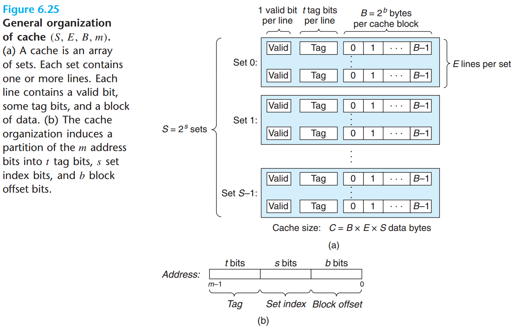

* `m`位（虚拟或物理）地址
  * `s`位作为 *组索引（Set index）*
  * `b`位作为 *块偏移（Block offset）*
  * 剩下的`t = m-(b+s)`位作为 *标记（tag）*
* **抖动（thrash）** 高速缓存反复地加载和驱逐高速缓存块相同的组

## Cache的几种结构

### 直接映射高速缓存

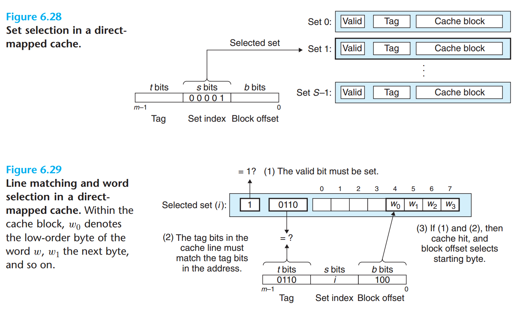

* 直接映射高速缓存（direct-mapped cache）每组只有一行
* 这种方式的优点是实现起来简单，只需利用主存地址中的某些位直接判断，即可确定所需字块是否miss
* 缺点是cache利用率低，cache 和 memory组 之间的映射被固定了，导致降低命中率

### 组相联高速缓存 *

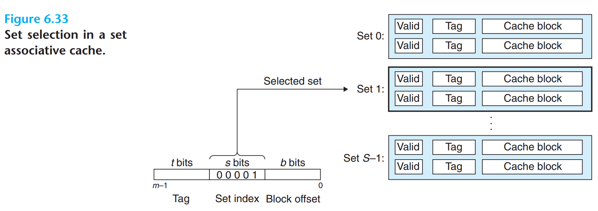
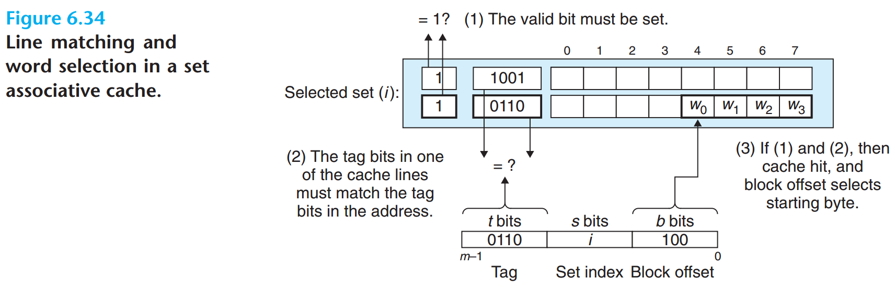

* 组相联高速缓存（set associative cache）每组有多个高速缓存行
* 组中的任何一行都可以包含任何映射到这个组的存储块
  * 所以，在组内搜索时必须并行搜索组中的每一行，而不是逐行依次匹配
  * 寻找一个有效的行，其标记与地址中的标记相匹配

#### miss时的行替换

* 随机选择策略
* FIFO策略
* **最不常使用（least-frequently-used, LFU）** 策略
  * 替换在过去某个时间窗口内引用次数最少的那一行
* **最近最少使用（leaset-recently-used，LRU）** 策略
  * 最后一次访问时间最久远的那一行

### 全相联高速缓存

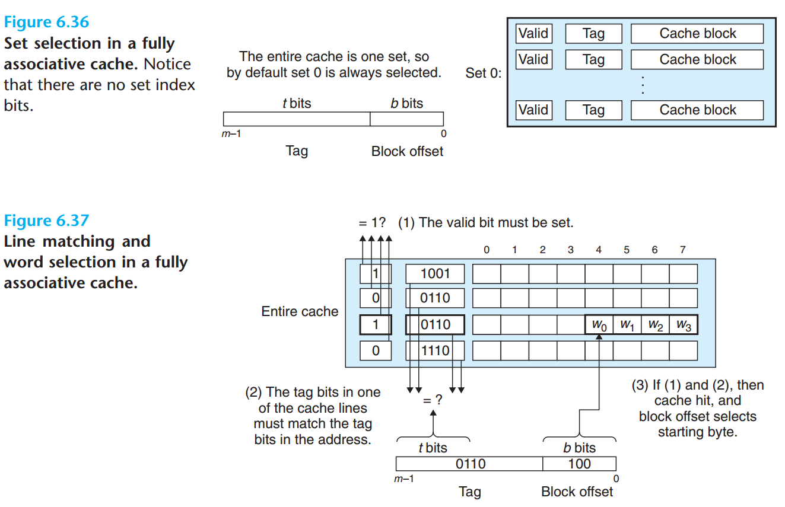

* 全相联高速缓存（fully associative cache）所有的高速缓存行组成一个组
* 因为高速缓存电路必须并行地搜索许多相匹配的行，构造一个又大又快的相联的高速缓存很困难，而且很昂贵。因此，全相联高速缓存只适合做小的高速缓存，如 **TLB**

## 写策略

* 表明数据是如何保存到高速缓存和主存的
* 大多数情况下，直写高速缓存都是非写分配的，写回高速缓存是写分配的

### 写命中

* 写命中（write hit）CPU 写一个已经缓存了的字
* **直写（write-through）** 来自 CPU 的数据既会写入高速缓存也会写入主存
  * 优点：主存始终保持在“最新”状态，与 cache 保持一致
  * 缺点：每条存储指令都会引起总线上的一个写事务，有可能会降低系统速度
* **写回（write-back）** 尽可能地推迟主存的更新，只有当替换算法要驱逐已更新的块时，才把它写到主存
  * 优点：显著地减少总线事务的数量
  * 缺点：增加复杂性，主存和高速缓存的数据有可能不一致。为了重获一致性，往往需要操作系统的介入
  * 必须为每个高速缓存行维护一个额外的 **修改位（dirty bit）**，表明这个高速缓存块是否被修改过

### 写缺失

* **写分配（write allocate）** 当要写入的字不在高速缓存中时，加载相应存储块到高速缓存中，然后更新这个高速缓存块
  * 优点：利用时间局部性和空间局部性
  * 缺点：每次不命中都会导致一个块从主存传送到高速缓存
* **非写分配（non-write allocate）** 不命中时，避开高速缓存，直接把这个字写到主存中，而高速缓存的内容不变

## 高速缓存参数的性能影响

* **不命中率（miss rate）** 不命中数量/引用数量
* **命中率（hit rate）**        1 -  不命中率
* **命中时间（hit time）**  从 cache 传送一个字到 CPU 所需的时间，包括组选择、行确认和字选择的时间
* **不命中处罚（miss penalty）** 由于不命中所需要的额外时间，需要从下一级缓存中得到服务的处罚

### 高速缓存大小的影响

* 较大的缓存可能会提高命中率
* 使大存储器运行的更快总是要难一些的，因此较大的高速缓存可能会增加命中时间

### 块大小的影响

* 较大的块能利用程序中可能存在的空间局部性，帮助提高命中率
* 对于给定的高速缓存大小，块越大意味着高速缓存行数越少，这会损害时间局部性比空间局部性更好的程序的命中率
* 较大的块对不命中处罚也有负面影响，因为块越大，传送时间就越长

### 相联度的影响

* 组中的行较多，降低了高速缓存由于冲突不命中出现抖动的可能性
* 较高的相联度的缺点
  * 会造成较高的成本。实现起来很昂贵，且很难使之速度变快
  * 每一行需要更多的标记位
  * 每一行需要额外的 LRU 状态位和额外的控制逻辑
  * 增加命中时间，因为复杂度增加了
* 相联度的选择最终变成了命中时间和不命中处罚之间的折中

### 写策略的影响

* 直写高速缓存比较容易实现
* 写回高速缓存引起的传送比较少，因此允许更多的到存储器的带宽用于执行 DMA 的 I/O 设备
* 层次结构越往下走，传送时间增加，减少传送的数量就变得更加重要
* 一般而言，高速缓存越往下层，越可能使用写回而不是回写

## 硬件高速缓存一致性

* 硬件高速缓存一致性不需要由软件显示地进行冲洗，就能保持 MP 系统上 cache 和主存储器间的数据一致性
* 因为总线上使用的物理地址，所以只有物理索引的 cache 才能使用硬件一致性机制
* **监听协议（snooping protocol）**：用在基于总线的系统上的协议，因为每个 cache 都要监视或者监听其他 cache 的总线活动
* 监听协议分为两大类
  * **写-使无效（write-invalidate）**:在一个处理器修改了已经由其他处理处理器高速缓存的数据时，向系统内的所有其他高速缓存广播一则 *使无效* 消息
  * **写-更新（write-update）**：在一个处理器修改数据的时候广播它的新值，以便系统内的所有其他 cache 正好缓存了受影响的行，就可以更新它们的值
* 在 MESI 协议中，每个 cache Line（x86 中是 64 bytes）都有 **MESI** 四种状态，cache line 实际上是加了几个 bits 来表示这些状态
* 在 Intel CPU 中引入 HA 和 CA 来管理这些状态以及同步各个 cache line 的副本
  * **Home Agent（HA）**，连接到 *内存控制器端*，
    * 持续跟踪 cache line 所有权
    * 从其他 CA 或内存中获取 cache line 数据
  * **Cache Agent（CA）**，连接到 *L3 Cache 端*，cache misses 的时候为 cache line 数据制作请求发送给 HA
* 他们都在 ring bus 上监听和发送 snoop 消息，这种模型叫做 **Bus snooping 模型**，与之相对的还有 **Directory 模型**
* Snoop 消息会在 QPI 总线上广播，会造成很大的带宽消耗，为了减小这种带宽消耗，如何 snoop 有很多讲究
* 在 [quick-path-interconnect-introduction-paper.pdf](https://www.intel.ca/content/dam/doc/white-paper/quick-path-interconnect-introduction-paper.pdf) 里面有介绍 Intel 的两种 snoop 的方式：Home Snoop 和 Source Snoop，它们的主要区别在于谁主导 snoop 消息的发送:
  * HA 主导叫做 **Home Snoop**
  * CA 主导叫做 **Source Snoop**

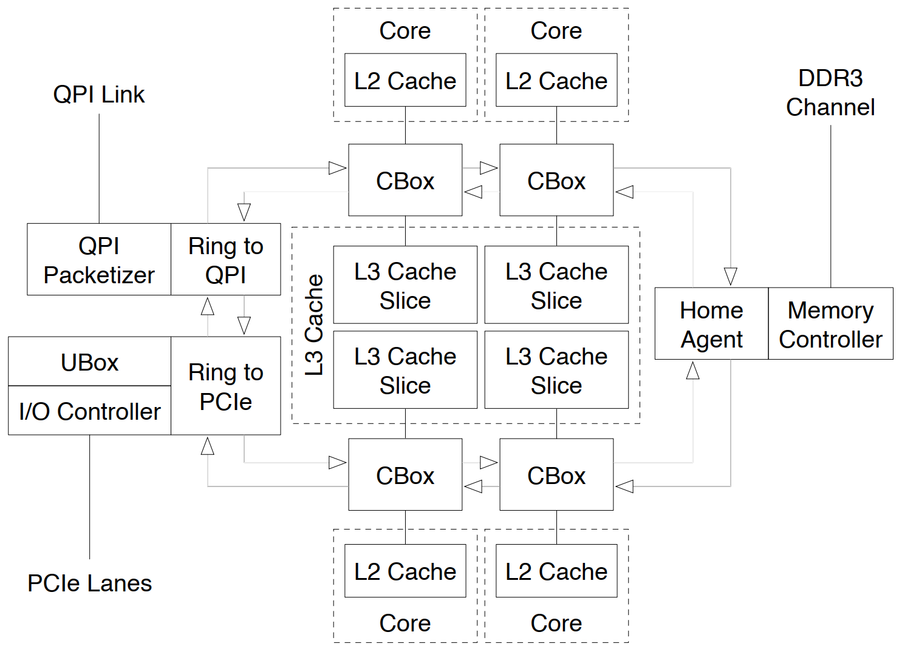

* Hashing scheme 映射物理地址到 LLC 分片（last-level cache slice）上，避免某个分片成为热点
* LLC 分片的数目和一个 CPU 里的 core 的数目一致
* 每个 LLC 分片和一个 core 共享一个 CBox
* CBox 实现 cache 一致性引擎，所以 CBox 作为它的 LLC 分片的 QPI cache agent

## Cache 的行为控制
* Intel 处理器的 cache 行为主要由
  * **内存类型范围寄存器（Memory Type Range Register，MTRR）** 和 **页属性表（Page Atrribute Table，PAT）** 配置
  * 控制寄存器 **Control Register 0（CR0）** 的 *Cache Disable（CD）* 和 *Not-Write through（NW）* 位
  * 页表条目中的同等位，即 *Page-level Cache Disable（PCD）* 和 *Page-level Write-Through（PWT）* 位
* PAT 意图是允许操作系统或 hypervisor 可以调整由计算机的固件在 MTRR 中指定的 cache 行为
  * PAT 有 8 个条目来指定 cache 的行为，它的实体存储在一个 MSR 里
  * 每个页表条目包含 3 bit 的索引，指向一个 PAT 条目，所以系统软件通过控制页表可以用一个非常细的粒度来指定 cache 的行为

# MESI 协议

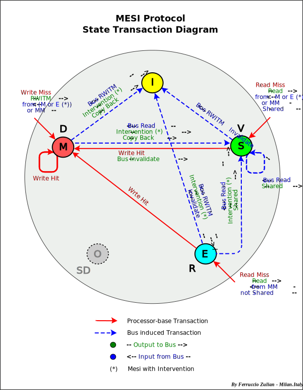

* MESI 协议是一个 cache line 4 种状态的单词的首字母，分别是：
  * Modified（已修改）：私有的脏数据
  * Exclusive（独占）   ：私有的干净数据
  * Shared（共享）       ：共享的干净数据
  * Invalidated（已失效）
* CPU load 缺失后初始进入的要么是 *独占（E）* 状态，要么是 *共享（S）* 状态
  * load 缺失会引发一次总线事务，确定状态该是 E 还是 S
* 对 S 状态的 cache line 写，需要先发出一次总线事务，使其他处理器上的副本无效（变成 I）
* 本 CPU *已修改（M）* 的 cache line 被其他 CPU 读到时，会将 cache line 的数据写到内存，使其他 CPU 也能看到最新的数据，状态也随之变为 *共享（S）*。其他 CPU 如果接着再写，就会使本 CPU 的 cache line 变为 invalidated；写完后其他 CPU 的 cache line 状态变为 modified（而不是 exclusive，因为还没有同步到内存）。
* 由此可见，*load 缺失* 和 *写 S 状态* 的开销相对比较大

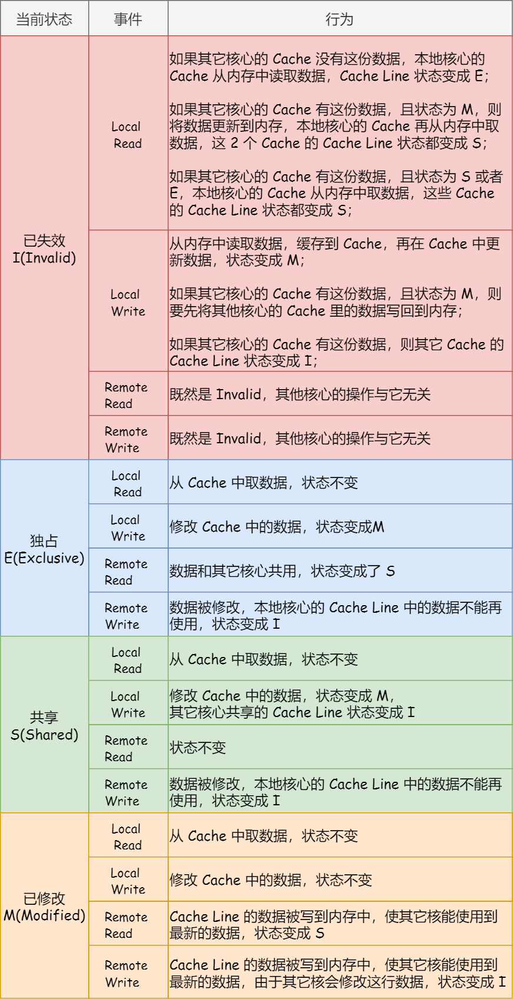

* cache 颠簸问题：两个无关的全局数据在同一个 cache line，分别对它们写会照成不停地互相 *使无效*，该现象为伪共享（false sharing）

# TLB
* TLB (Translation Lookaside Buffer) 后备缓冲器
## TLB 的组成部分
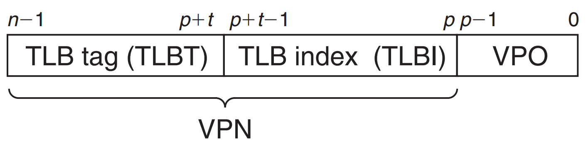

* VPN: virtual page number
* VPO: virtual page offset
## TLB 命中

### 命中 HIT

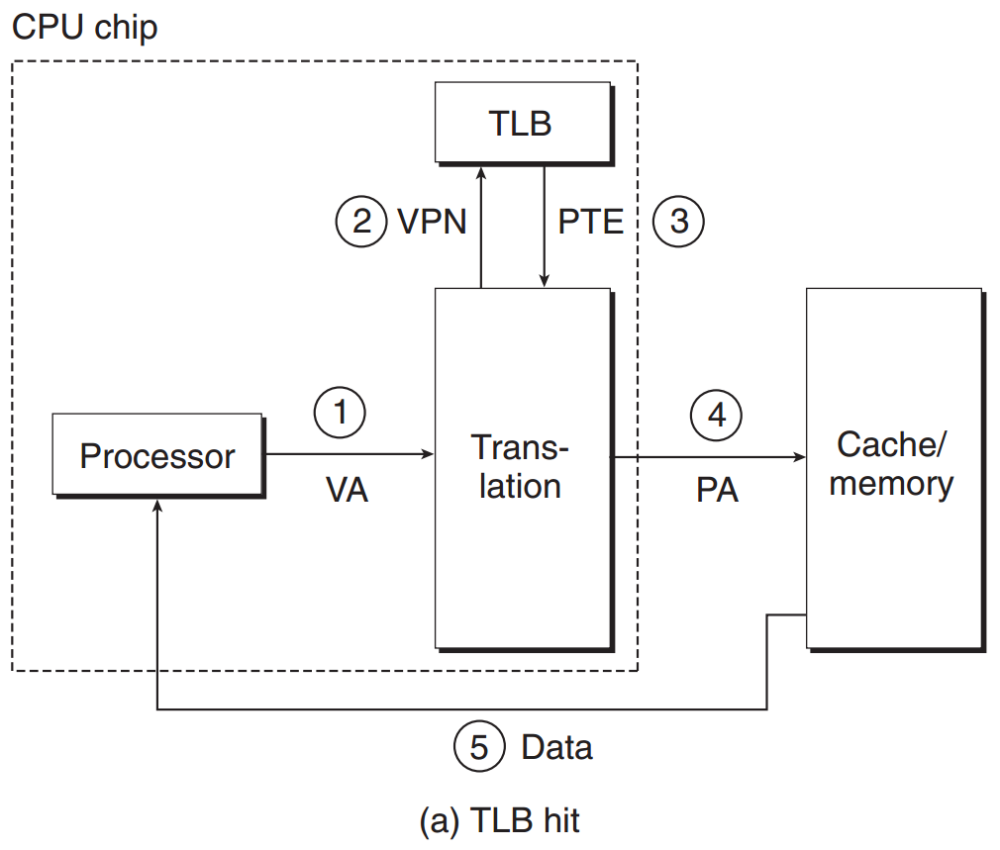

### 缺失 MISS
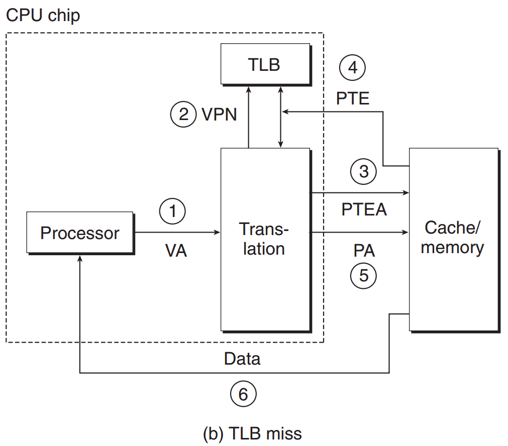

## 地址翻译的例子
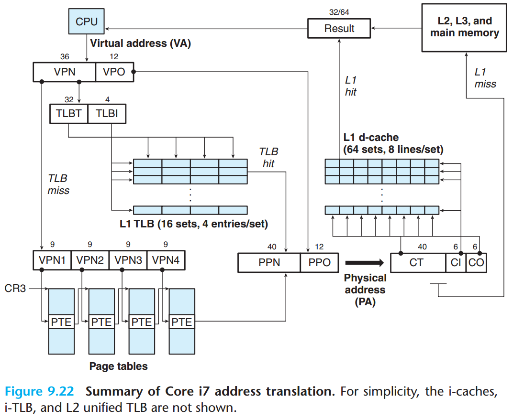

* x86-64 用虚拟地址的 48 位进行寻址，其中高 36 位为虚拟页号（VPN），低 12 位为虚拟页中的偏移（VPO）
* L1 TLB 有 16 组，每组 4 个条目
* 虚拟地址的 36 位 VPN 用来查找 TLB，因为 TLB 有 16 组，所以用 4 位来索引 TLB，即 TLBI，剩下的 32 位作为 TLBT
  * 如果 TLB 命中，则得到 PTE 中的 40 位的物理页号（PPN），12 位的 VPO 对应到同样是 12 位的 PPO，组合起来得到物理地址
  * 如果 TLB 不命中，即 PTE 没被缓存，那么 MMU 会先在 paging-structure-cache 条目中寻找页目录
  * 如果还找不到，则只能从主存中取到 pagetable 并 walk，并最终形成物理地址
* x86-64 默认用的四级页表完成地址转换，虚拟地址段的划分是 **9-9-9-9-12**
  * VPN[1-4] 之所以用 9 位，是因为默认采用 4KB 的页，而一个页表条目为 64 bit，8 Byte，因此一个页能存下 512 个页表条目，故而用 9 位来索引
* 顶级页表 PGD 的物理地址存在 `CR3` 寄存器中，进程切换时需要加载换入进程的 PGD 到 `CR3`
* 通过查找页表最终得到对应的物理地址，否则 MMU 会触发一个缺页异常
* Core i7 的 Cache 在 MMU 之后，因此是 **物理高速缓存**，缓存的是物理地址中的内容
* L1 d-cache 有 64 组 8 路组相联
  * 有 64 组，故而高速缓存索引 CI 用了 6 位
  * CO 用了 6 位，说明一个 cache line 有 64 个块
  * 剩余的 40 位作为高速缓存标识 CT
* 高速缓存命中直接将物理地址的内容返回给 CPU
* 高速缓存不命中，则到下一级高速缓存中查找
* `PPO 12 位 = CI 6 位 + CO 6 位`不是偶然，包括 L1 d-cache 的组数和 cache line 的大小，都不是偶然，而是一种刻意的优化，CPU 需要翻译一个地址时，VPN 发给 MMU，VPO 发送给 L1 cache，这样查找 TLB 的同时可以进行 Cache 的查找

# References

- [quick-path-interconnect-introduction-paper.pdf](https://www.intel.ca/content/dam/doc/white-paper/quick-path-interconnect-introduction-paper.pdf)
- [高速缓存与一致性专栏索引](https://zhuanlan.zhihu.com/p/136300660)
- [memory ordering – Gavin's Blog](http://gavinchou.github.io/summary/c++/memory-ordering/)
* [wiki - Cache coherency protocols (examples)](https://en.wikipedia.org/wiki/Cache_coherency_protocols_(examples))