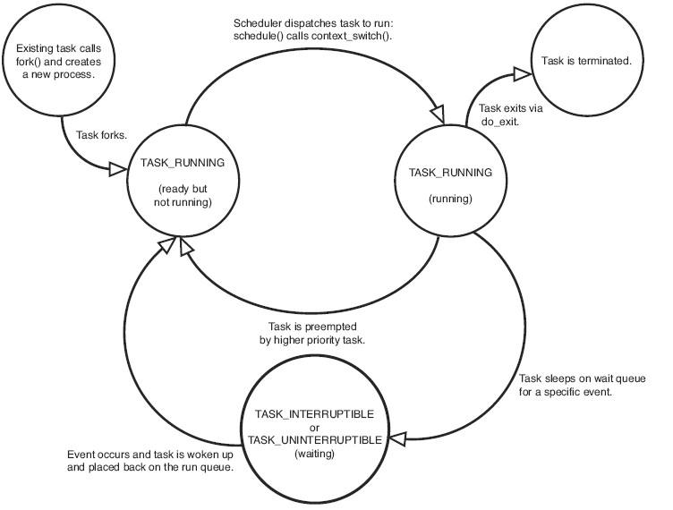
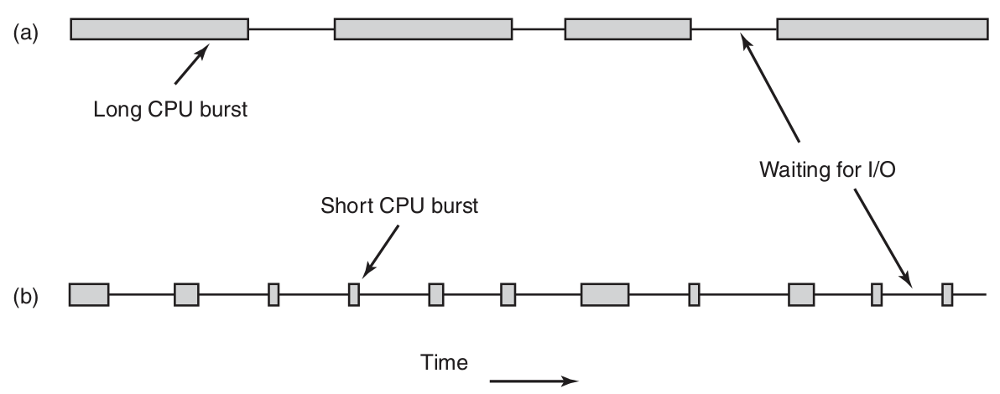
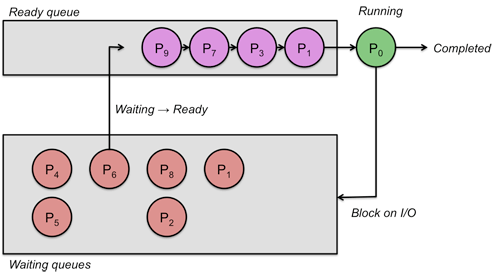

# 进程调度

## 进程

### 进程状态

### 进程类型

* CPU 密集型（ CPU-bound ）
* IO 密集型（ I/O-bound ）

### 主要任务
* 运行 **哪个** 进程
* **何时** 调度
* 运行 **多长** 时间

### 何时调度
* *fork*
* *exit*
* IO / 信号 阻塞
* IO中断结束
* 时钟中断

### 进程切换的代价
* *User Mode* 切换到 *Kernel Mode*
* 上下文切换
* 新进程内存映像装入 MMU
* Cache 更新

## 调度

> 进程调度器是传统的说法。实际上进程是资源管理的单位，线程才是调度的单位

### 调度分类

* 批处理
* 交互式
* 实时
  * 有实时限制的系统中抢占有时并不需要
  * 实时系统与交互式系统的差别：
    * 实时系统只运行那些用来推进现有应用的程序
    * 交互式系统可以运行任意的非协作甚至是有恶意的程序

### 抢占与非抢占式

* 非抢占式调度算法，不会在时钟中断发生时进行调度
* 抢占式调度算法，在时间间隔的末端发生时钟中断，把 CPU 控制返回给 Scheduler

### 算法目标
*不同环境下衡量好的调度算法的目标并不相同*

#### 通用系统
* 公平——给每个（同类）进程的CPU份额
* 策略强制执行——看到所宣布的策略执行
* 平衡——保持系统所有部分都忙碌

#### 批处理系统
* 吞吐量（throughout）——每小时最大作业数
* 周转时间（turnaround time）——从提交到终止间的最小时间，小就是好的
* CPU利用率——保持CPU始终忙碌

#### 交互式系统
* 响应时间——快速响应请求
* 均衡性——满足用户的期望

#### 实时系统
* 满足截止时间——避免丢失数据，满足所有的（或大多数）截止时间要求
* 可预测性——在多媒体系统中避免品质降低

## 调度算法

### 批处理调度算法

#### 先来先服务 FCFS
 

#### 最短作业优先 SJF

* https://en.wikipedia.org/wiki/Shortest_job_next

#### 最短剩余时间优先 SRTF

* preemptive 版本的SJF
* https://en.wikipedia.org/wiki/Shortest_remaining_time

### 交互式系统调度算法
#### 轮转调度（Round robin）

* **时间片（time slice/quantum）** 每个进程被分配一个时间段，允许该进程运行的时间。

* 假设所有进程同等重要
* https://en.wikipedia.org/wiki/Round-robin_scheduling

#### 优先级调度（Priority scheduling）

* 调度程序在每个时钟滴答降低当前进程优先级
* 当前进程优先级低于次高优先级进程，则进行进程切换
* 可将进程分类，各类之间采用优先级调度，各类进程内部采用轮转调度
* 缺点：低优先级进程很可能会产生饥饿现象

#### 多级队列（Multi-level Queues）

* 根据预定的算法插入不同的队列
* 不能在不同级别之间任意移动
* 每个级别间的调度算法可以任意选择
* https://en.wikipedia.org/wiki/Multilevel_queue

#### 多级反馈轮转调度（round robin with multiple feedback）：UNIX

* 内核给进程分配一个CPU时间片，抢占一个超过其时间片的进程，并把它反馈到若干优先级队列中的某一个队列。
* 一个进程在它结束之前，可能需要多次通过“反馈轮转”。

* 每次重新计算优先级值的效果是，具有用户级优先级的进程在优先级队列之间移动
* 内核不改变核心态进程的优先级
* 时钟中断处理程序中，会改变处于用户态进程的优先级
* 不允许具有用户级优先级的进程跨越优先级阈值而获得核心级优先级，除非通过系统调用陷入内核
* 进程进入哪个核心态优先级队列的依据不是运行时的特性，而是根据睡眠原因而定的常量（hard-coded）
* 换句话说，核心态进程优先级值是常量

**System V的进程优先级计算**

在下面例中Base = 60

* 不同版本的UNIX上的CPU衰减公式和优先级公式并不一样

#### 公平共享调度（Fair Share Scheduling）：UNIX
调度原则：

* 将用户团体分为一些公平共享组
* 每组成员受到常规的进程调度的限制，即组内成员公平共享
* CPU时间按比例分配给每个组，不考虑组中成员有多少
  * 可以理解为，从组外来看，每个组作为一个单位与其他进程参与调度；组内则平均分配CPU时间。

#### 其他调度算法
* 最短进程优先  ——  老化技术（aging）
* **多级反馈队列**  ——  图灵奖 *
* 保证调度         ——  选择获得CPU比率最低的进程
* 彩票调度         ——  重要的进程获得更多的彩票
* 公平共享调度 ——  考虑进程拥有者的因素

### 实时系统中的调度

#### 实时系统分类
* **硬实时**
  * 必须满足绝对的deadline
* **软实时**
  * 偶尔错失deadline是可容忍的

#### 实时系统可调度的条件

有n 个周期事件，事件 *i* 以周期 _Pi_ 发生，并需要 _Ci_ 秒CPU时间处理一个事件，可处理负载的条件。

#### 实时系统调度算法分类
* 静态调度
  * 系统开始运行之前做出调度决策
  * 只有在可以提前掌握所需完成工作以及必须满足的deadline等全部信息时才能工作
* 动态调度
  * 在运行过程中进行调度决策
  * 最早 deadline 优先算法 **Earliest deadline first (EDF)**
    * https://en.wikipedia.org/wiki/Earliest_deadline_first_scheduling

## 参考资料
* Modern Operating Systems (4th Edition), Andrew S. Tanenbaum, Herbert Bos
* Linux Kernel Development (3rd Edition), Robert Love
* https://en.wikipedia.org/wiki/Scheduling_%28computing%29
* http://www.cs.rutgers.edu/~pxk/416/notes/07-scheduling.html
* http://orzhovgilden.site11.com/projects/CPU.html
* https://en.wikipedia.org/wiki/Cooperative_multitasking
* The Design of the UNIX Operating System, Maurice J. Bach
* https://en.wikipedia.org/wiki/Scheduling_%28computing%29
* https://en.wikipedia.org/wiki/Multilevel_feedback_queue
* https://en.wikipedia.org/wiki/Fair-share_scheduling
* https://en.wikipedia.org/wiki/Round-robin_scheduling