# Linux 进程调度
## 默认调度器的演变
| Operating System          |                          Algorithm                           |
| ------------------------- | :----------------------------------------------------------: |
| Linux kernel before 2.6.0 |                         O(n) 调度器                          |
| Linux kernel 2.6.0–2.6.23 |                         O(1) 调度器                          |
| Linux kernel after 2.6.23 | [CFS 调度器](https://en.wikipedia.org/wiki/Completely_Fair_Scheduler) |

## O(N)调度器

### 总览


- 调度器只定义了一个全局 **runqueue** 运行队列，Running 的进程都会被添加到 runqueue 中（无论常规进程还是 RT 进程），当发生进程切换时，调度器从 runqueue 的 head 搜寻到 tail，找到 priority 最高的进程。

- 当 runqueue 中的进程数目逐渐增多，则调度器的效率会出现明显的下降

- 除了 runqueue 队列，系统还有一个囊括所有 task 的链表，链表头定义为 init_task ，在一个调度周期结束（runqueue 中的进程时间片全被用完）后，重新为 task 赋初始时间片的时候会用到该链表

  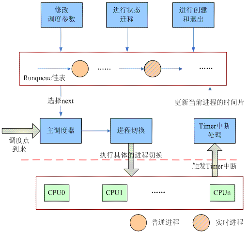

  
### task_struct

```c
struct task_struct {
    volatile long need_resched;
    long counter; // 该进程分配的CPU时间额度，以tick为单位（对于睡眠的进程还有些奖励
    long nice;    // 普通进程的静态优先级
    unsigned long policy; // 主要支持三种调度策略：普通进程：SCHED_OTHER   实时进程：SCHED_RR / SCHED_FIFO
    
    int processor;
    unsigned long cpus_runnable, cpus_allowed;
    
    struct list_head run_list;
    unsigned long rt_priority; // RT 进程的优先级
    ......
};
```

- 调度策略
  - 顾名思义，*SCHED_RR* 采用时间片轮转
  - *SCHED_FIFO* 为先到先得，先占有 CPU 的进程会持续执行，直到退出或者阻塞的时候才会让出 CPU
  
- CPU 相关
  - *processor*：该进程正在执行（或者上次执行）的逻辑 CPU 号
  - *cpus_allowed*：该 task 允许在那些 CPU 上执行的掩码
  - *cpus_runnable*：计算一个指定的进程是否适合调度到指定的 CPU 上去执行。如果该进程没有被任何 CPU 执行，那么所有的 bit 被设定为 1，如果进程正在被某个 CPU 执行，那么正在执行的 CPU bit 设定为 1，其他设定为 0（来自 *can_schedule* 函数）

- Priority

  - 静态优先级：task 固有的优先级，不会随着进程的行为而改变。普通进程：（20 - nice）， 实时进程：rt_priority

  - 动态优先级：

    - 实际 CPU 调度依赖动态优先级，动态优先级是基于静态优先级计算的（来自 *goodness* 函数）

    - 普通进程的动态优先级

      ```c
      weight = p->counter;
      if (!weight)
      	goto out;
      weight += 20 - p->nice;
      ```
    
      > 1. 如果该进程的时间片已经耗尽，那么动态优先级是 0，这也意味着在本次调度周期中该进程无法继续获取 CPU 资源
      >
      > 2. 如果该进程的时间片还有剩余，那么 `weight = 剩余的时间片 + 静态优先级`，考虑剩余时间片的目的是奖励睡眠的进程
      >
      > 3. 调度器也会酌情考虑 Cache 和 TLB 的性能问题，更倾向于被调度到之前的核心；如果备选进程和当前进程共享同一个地址空间，也会得到小小的倾斜
    
    - 实时进程的动态优先级
      ```c
      weight = 1000 + p->rt_priority;	
      ```
      > 加上这个固定偏移 `1000` 是为了和普通进程区分，使 RT 进程能完全优先于普通进程
      

### 主调度器的核心

```c
list_for_each(tmp, &runqueue_head) {
    p = list_entry(tmp, struct task_struct, run_list); // 本次需要检查的进程描述符
    if (can_schedule(p, this_cpu)) {
        int weight = goodness(p, this_cpu, prev->active_mm);
        if (weight > c)
            c = weight, next = p;
    }
}
```

- 遍历 runqueue_head 链表上的所有的进程，计算动态优先级，选择并切换
- 每一个 tick 到来的时候，进程时间片减一 `-- p->counter`，当时间片减到 0 ，调度器剥夺其执行的权力，从而引发一次调度，直到 runqueue 中的所有进程时间片耗尽，然后开始一个新的周期。调度器就这样周而复始，推动整个系统的运作

### 六宗罪

1. 随着 runqueue 增大，遍历的开销线性增长，且调度周期结束时，需要对成千上万个进程的时间片进行充值，不仅计算时间开销巨大，还会干掉 *L1 Cache* 中的几乎所有内容（L1 里被换上了用于计算 counter 的内容，于实际任务执行无益）

2. 全局共享一个由 spinlock 保护的 runqueue，对于 SMP 处理器而言 spinlock 的开销将成为性能瓶颈

3. CPU 空转问题：假设平台为树莓派zero2w，每次调度周期结束，总有一个 CPU 负责充值而其他 3 个 CPU 无事可做，只能处于 idle 状态，资源被大大浪费

4. 原本调度器设计有 CPU 亲和性，但是随着 runqueue 中的进程一个个耗尽时间片，CPU 可选择的余地被不断压缩，CPU 经常只能运行一个和它亲和性不大的进程。当时很多人都反映有进程在 CPU 之间跳来跳去，这一现象被称作 CPU bouncing

5. RT 调度的性能问题
   - RT 进程和普通进程处于同一队列，这导致对于 RT 的调度也要遍历整个 runqueue

   - Linux 2.4 内核不支持抢占式，对于一些比较耗时的系统调用或者中断处理（几个 ms），必须返回用户空间才能启动调度

   - 存在 **优先级翻转** 隐患：对于优先级 A > B > C 的情况，A 被调度时发现 C 正在运行且占用自己正要用的资源，A 睡眠等待，目前为止一切正常。  然后 B 被调度，B 优先级高可以直接运行，这就导致优先级低的优先执行。A：

     

     > 采用 **优先级继承** 解决：A 被阻塞时，将 C 的优先级暂时提升到 A 的水平，等到 C 释放资源再恢复

6. 调度器无法正确感知进程真正的需求，因为批处理进程会经常阻塞在 Disk I/O 上，而用户进程可能是 计算密集型 的，这导致 睡眠补偿 这一策略并不总是正确的

## O(1) 调度器

### 总览

O(1) 调度器引入了 **per-cpu runqueue** , 系统中所有 runnable 进程首先经过 **负载均衡** 挂入 各 CPU 的 runqueue，spinlock 也被细分为 per-cpu runqueue 中的 `rq->lock`，然后由 主调度器 和 tick 调度器 驱动该 CPU 上的调度行为。（解决了 *第二和第三宗罪*，*第四宗罪* 通过良好的负载均衡解决）

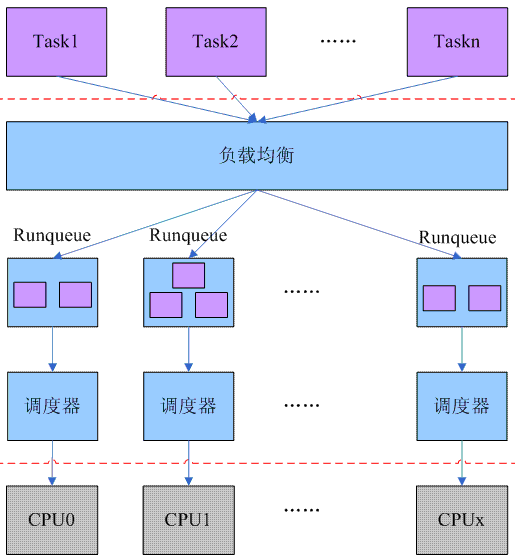

### 引入优先级队列

- O(1) 调度器将原来单个 runqueue 切分为多个不同 priority 的链表：

  ```c
  struct runqueue {
      spinlock_t lock;
  	......    
      struct prio_array *active;  // 时间片 有剩余
      struct prio_array *expired; // 时间片 已耗尽
      struct prio_array arrays[2]; 
      ......
  };
  
  struct prio_array {
      int nr_active; // 队列中 task 数量
      unsigned long bitmap[BITMAP_SIZE]; // 各优先级进程链表是 空 还是 非空
      struct list_head queue[MAX_PRIO];
  };
  ```

  <div style="display: flex; align-items: flex-start;">
    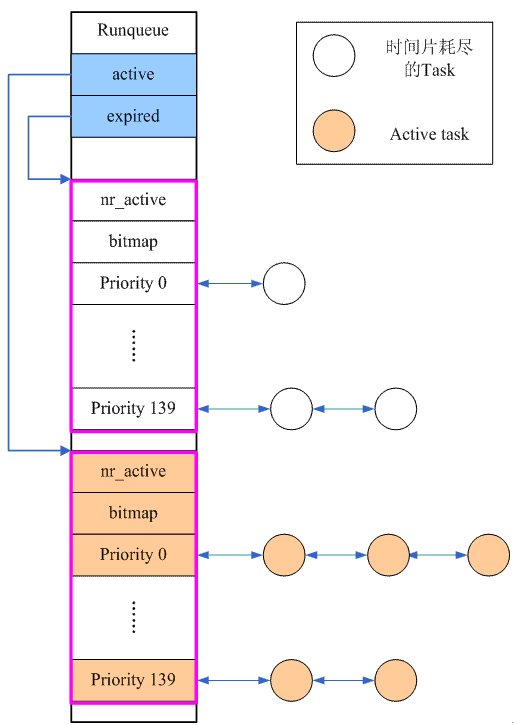
    <div>
      <pre style="background-color: #f4f4f4; padding: 0px; border-radius: 0px;">
  <code>
  /* 如果 active 队列空无一人，则切换两个队列 */
  if (unlikely(!array->nr_active)) {
      rq->active = rq->expired;
      rq->expired = array;
      array = rq->active;
  }
  </code>
      </pre>
      <p>随着系统的运行，active 队列的 task 一个个的耗尽其时间片，挂入到 expired 队列，当 active 队列的 task 为空的时候，切换 active 和 expired ，开始一轮新的调度过程。</p>
    </div>
  </div>

- 在 O(1) 调度器中，每个 runqueue 支持 140 个优先级：RT 进程 1 ~ 99；普通进程 100 ~ 139 ，分别对应 *nice* 的 -20 ~ 19 。不同优先等级的进程被放入不同的链表中，RT进程 也因此和 普通进程 区分开来，解决了 *第五宗罪*


- 识别交互式进程（解决 *第六宗罪* ）

  - 特殊处理的交互式进程

    ```c
    if (!TASK_INTERACTIVE(p) || EXPIRED_STARVING(rq)) {
        enqueue_task(p, rq->expired);
        if (p->static_prio < rq->best_expired_prio)
        rq->best_expired_prio = p->static_prio;
    } else {
    	enqueue_task(p, rq->active);
    }
    ```

    *TASK_INTERACTIVE* 用来判断一个进程是否是一个用户交互式进程

    - [ n ]：挂入 expired 队列

    - [ y ]：用户交互型进程，重新挂回 active 队列

      > O(1) 调度器使用非常复杂的算法判断是否为交互式进程，尤其是含有大量的硬编码（通过大量实验场景总结出来的常数）

    *EXPIRED_STARVING* 用于制止 不知好歹 的用户

    - 如果 expired 队列中的进程等待时间过长，说明调度器出现不公平现象，此时即使是用户交互型也会被挂入 expired

### 核心调度算法

> 从 runqueue 的 active 队列中寻找：
>
> ```c
> idx = sched_find_first_bit(array->bitmap);
> queue = array->queue + idx;
> next = list_entry(queue->next, task_t, run_list);
> ```
>
> 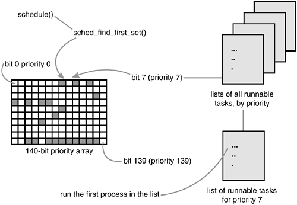
>
> 首先在对应的 **bitmap** 中寻找第一个非空的进程链表，其第一个节点就是当前最适合被调度的进程。由于没有遍历整个链表的操作，调度器算法复杂度是常量，解决了 *第一宗罪*

至此，O(n) 调度器的六宗罪完全被 O(1) 调度器解决。O(1) 调度器是 Linux 迄今为止（2007.10.08）最伟大的调度器，因此我宣布，从今以后，Linux内核 使用的默认调度器为：

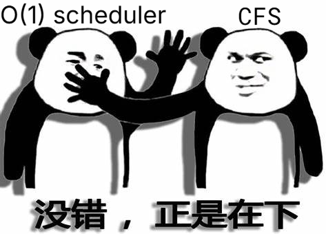

## 插一脚，关于抢占式内核

​	2.4 时代，大部分的Linux应用都集中在服务器领域，因此选择设计 *非抢占式内核* 无可厚非。不过随着 Linux在桌面和嵌入式领域的渗透，系统响应速度慢慢的称为用户投诉的主要方面，因此，在 2.5 的开发过程中，Linux引入了抢占式内核的概念（CONFIG_PREEMPT）

- 不配置该选项，那么一切与 2.4 内核保持一致
- 如果配置了该选项，则不需要在返回用户空间的时候才苦苦等到调度点，大部分的内核执行路径都是可以被抢占的

# 完全公平调度

## 公平调度思想的引入

- 传统调度器的问题

  - 时间片悖论

    在 O(n) 与 O(1) 调度器中，时间片是固定分配的，高优先级的获取更多的执行时间。但实际上，需要更多执行时间的 CPU 密集型进程往往在后台执行，优先级理应比较低

  - 卡顿问题

    当一个相当消耗CPU资源的进程启动的时候，现存的那些用户交互程序（例如浏览网页）都可以感觉到明显的延迟。但你无法 100% 穷举所有的交互型进程，就像你无法完全猜中女孩子的心一样

- RSDL 调度器： *开启公平调度的先锋* 

  - **Staircase**：在调度过程中，进程优先级类似台阶那样缓缓降低

    > 假设每个 Priority 配额为 6ms，进程 A 的优先级为120。A 在 Priority=120 的队列中运行 6ms，发生 **Rotating** ，转入 Priority=121 的队列 ...... 如此继续，直至在 Priority=139 的队列也运行完 6ms，此时该进程时间片耗尽， 挂入 expired 队列等待下一个调度周期。

  - **Deadline**：在RSDL算法中，任何一个进程可以准确的预估其调度延迟

    > 假设 runqueue 中有 2 个进程 A 和 B，静态优先级分别为 130 和 139，对于 B 进程，只有 A 沿着优先级阶梯走到 139 的时候才有机会执行，其调度延迟是9 x 6ms ＝ 54ms。

  > RSDL去掉了对进程睡眠 / 运行时间的统计，去掉了对用户交互指数的计算，去掉了那些奇奇怪怪的常数，成就了一个简洁高效的公平调度算法。在 2.5 内核时代被发明，却被众多厂商反向引入 2.4 内核，可见其性能优异。  但可惜的是，RSDL 在高负载时调度效率下降，容易出现调度不公平的情况；设计没有 CFS 简洁易维护；且在需要频繁上下文切换的应用中表现欠佳，实际生产测试不如 CFS

## CFS调度器

## 调度的目标

* 任何进程获得的处理器时间是由它自己和其他所有可运行进程 nice 值的相对差值决定的
* 任何 nice 值对应的时间不再是一个绝对值，而是 **处理器的使用比**
* nice 值对时间片的作用不再是算术级增加，而是几何级增加
* 公平调度，确保每个进程有公平的处理器使用比

## 算术级数、几何级数与增长率

### 增长率
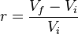

_V <sub> f </sub>_：最终值

_V <sub> i </sub>_：初始值


### 算术级数
数列中每一个数跟前一个数的差额是固定的。每期增长率不一样。如增长幅度是正的，越往后增长率越小。

数列|2|4|6|8|10|12
---|---|---|---|---|---|---
增长率|-|100%|50%|33%|25%|16.67%

如果采用算术级数，比如相邻两个 nice 值之间差额是 5ms，
* 进程 A 的 nice 值为 0，进程 B 的 nice 值为 1，则它们分别映射到时间片 100ms 和 95ms，差别并不大
* 进程 A 的 nice 值为 18，进程 B 的 nice 值为 19，则它们分别映射到时间片 10ms 和 5ms，前者比后者多了 100%的处理器时间

### 几何级数
数列中的数按固定的增长率增长。如增长率是正的，越往后增长幅度越大。

数列|2|4|8|16|32|64
---|---|---|---|---|---|---
增长率|-|100%|100%|100%|100%|100%

如果采用几何级数，比如说，增长率约为-20%，目标延迟是 20ms，
* 进程 A 的 nice 值为 0，进程 B 的 nice 值为 5，则它们分别获得的处理器时间 15ms 和 5ms
* 进程 A 的 nice 值为 10，进程 B 的 nice 值为 15，它们分别获得的处理器时间仍然是 15ms 和 5ms

> **目标延迟（targeted latency）**
> Each process then runs for a “timeslice” proportional to its weight divided by the total
> weight of all runnable threads. To calculate the actual timeslice, CFS sets a target for its
> approximation of the “infinitely small” scheduling duration in perfect multitasking. This
> target is called the **targeted latency**.
> Smaller targets yield better interactivity and a closer approximation to perfect
> multitasking, at the expense of higher switching costs and thus worse overall throughput.

> **时间片的最小粒度（minimum granularity）**
> Note as the number of runnable tasks approaches infinity, the proportion of allotted
> processor and the assigned timeslice approaches zero. As this will eventually result in
> unacceptable switching costs, CFS imposes a floor on the timeslice assigned to each
> process. This floor is called the minimum granularity. By default it is 1 millisecond. Thus,
> even as the number of runnable processes approaches infinity, each will run for at least 1
> millisecond, to ensure there is a ceiling on the incurred switching costs.

## 基本原理
* 设定一个调度周期（`sched_latency_ns`），目标是让每个进程在这个周期内至少有机会运行一次。换一种说法就是每个进程等待 CPU 的时间最长不超过这个调度周期。
* 根据进程的数量，大家平分这个调度周期内的 CPU 使用权，由于进程的优先级即 nice 值不同，分割调度周期的时候要加权。
* 每个进程的经过加权后的累计运行时间保存在自己的 `vruntime` 字段里。
* 哪个进程的 `vruntime` 最小就获得本轮运行的权利。

## 原理解析

### 静态优先级与权重
* 将进程的 nice 值映射到对应的权重
  * 数组项之间的乘数因子为 1.25，这样概念上可以使进程每降低一个 nice 值可以多获得 10%的 CPU 时间，每升高一个 nice 值则放弃 10%的 CPU 时间。
  * kernel/sched/core.c
```c
const int sched_prio_to_weight[40] = {
 /* -20 */     88761, 71755, 56483, 46273, 36291,
 /* -15 */     29154, 23254, 18705, 14949, 11916,
 /* -10 */      9548,  7620,  6100,  4904,  3906,
 /*  -5 */      3121,  2501,  1991,  1586,  1277,
 /*   0 */      1024,   820,   655,   526,   423,
 /*   5 */       335,   272,   215,   172,   137,
 /*  10 */       110,    87,    70,    56,    45,
 /*  15 */        36,    29,    23,    18,    15,
};
```

  由此可见，**nice 值越小, 进程的权重越大**。

* 静态优先级与权重之间的关系，分普通和实时进程两种情况
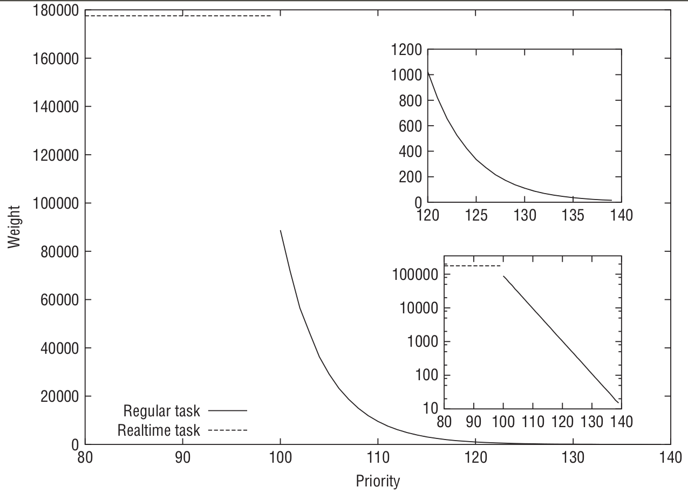

### CFS 里的调度周期
* CFS 调度器的调度周期由 `sysctl_sched_latency` 变量保存。
  * 该变量可以通过 `sysctl` 调整，见 kernel/sysctl.c
```sh
       $ sysctl kernel.sched_latency_ns
       kernel.sched_latency_ns = 24000000
       $ sysctl kernel.sched_min_granularity_ns
       kernel.sched_min_granularity_ns = 3000000
```

  * 任务过多的时候调度周期会延长，见 kernel/sched/fair.c
```c
/*
 * The idea is to set a period in which each task runs once.
 *
 * When there are too many tasks (sched_nr_latency) we have to stretch
 * this period because otherwise the slices get too small.
 *
 * p = (nr <= nl) ? l : l*nr/nl
 */
static u64 __sched_period(unsigned long nr_running)
{
    if (unlikely(nr_running > sched_nr_latency))
        return nr_running * sysctl_sched_min_granularity;
    else
        return sysctl_sched_latency;
}
```
### CFS 里关于时间计算的两个公式

#### 公式 1
* 一个进程在一个调度周期中的运行时间为:
```js
    分配给进程的运行时间 = 调度周期 * 进程权重 / 所有可运行进程权重之和
```

  可以看到, 进程的权重越大，分到的运行时间越多。

#### 公式 2
* 一个进程的实际运行时间和虚拟运行时间之间的关系为:
```js
    vruntime = 实际运行时间 * NICE_0_LOAD / 进程权重
             = 实际运行时间 * 1024 / 进程权重
             (NICE_0_LOAD = 1024, 表示nice值为0的进程权重)
```
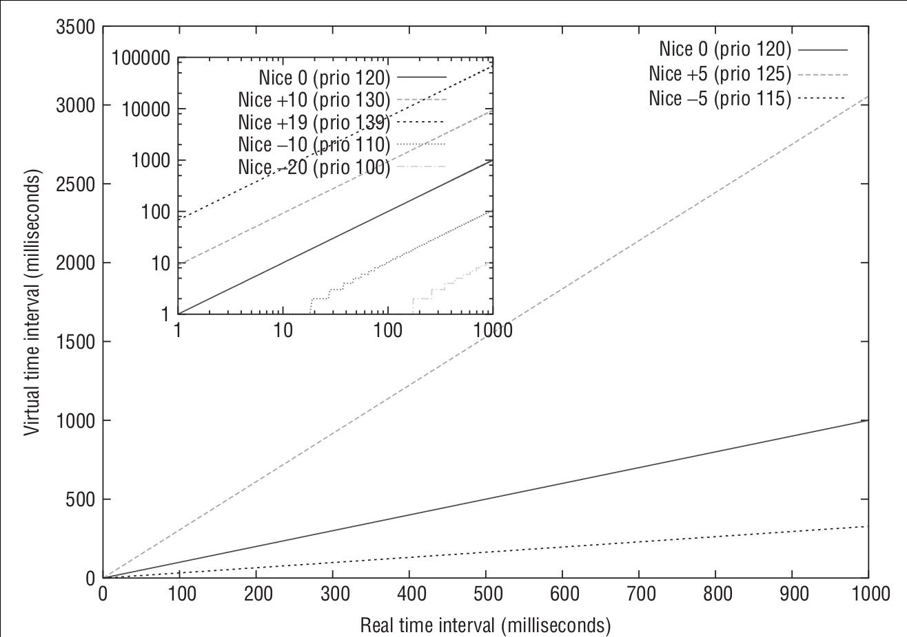

* 可以看到, **进程权重越大, 运行同样的实际时间, vruntime 增长的越慢**。

### 关于 CFS 的公平性的推理
* 一个进程在一个调度周期内的虚拟运行时间大小为:
```js
    vruntime = 进程在一个调度周期内的实际运行时间 * NICE_0_LOAD / 进程权重
             = (调度周期 * 进程权重 / 所有进程总权重) * NICE_0_LOAD / 进程权重
             = 调度周期 * NICE_0_LOAD / 所有可运行进程总权重
```
  可以看到，一个进程在一个调度周期内的 `vruntime` 值大小是不和该进程自己的权重相关的，所以所有进程的 `vruntime` 值大小都是一样的。

* 在非常短的时间内，也许看到的 `vruntime` 值并不相等。
  * `vruntime` 值小，说明它以前占用 cpu 的时间较短，受到了“不公平”对待。
  * 但为了确保公平，我们 **总是选出 `vruntime` 最小的进程来运行**，形成一种“追赶”的局面。
  * 这样既能公平选择进程，又能保证高优先级进程获得较多的运行时间。


* 理想情况下，由于 `vruntime` 与进程自身的权重是不相关的，所有进程的 `vruntime` 值是一样的。

* 怎么解释进程间的实际执行时间与它们的权重是成比例的？
  * 假设有进程 A，其虚拟运行时间为 `vruntime_A`，其实际运行的时间为 `delta_exec_A`，权重为 `weight_A`，于是 `vruntime_A = delta_exec_A * NICE_0_LOAD / weight_A`
  * 假设有进程 B，其虚拟运行时间为 `vruntime_B`，其实际运行的时间为 `delta_exec_B`，权重为 `weight_B`，于是 `vruntime_B = delta_exec_B * NICE_0_LOAD / weight_B`
  * 由于进程虚拟运行时间相同，即 `vruntime_A == vruntime_B`，
  * 则 `delta_exec_A * NICE_0_LOAD / weight_A == vruntime_B = delta_exec_B * NICE_0_LOAD / weight_B`
  * 也就是 `delta_exec_A : delta_exec_B == weight_A : weight_B`

  可见进程间的实际执行时间和它们的权重也是成比例的。

* 各个进程追求的公平时间 `vruntime` 其实就是一个 nice 值为 0 的进程在一个调度周期内应分得的时间，就像是一个基准。

# 核心调度器

## 调度器类

### 调度器类
* fair (Completely_Fair_Scheduler)
* real-time
* stop-task (sched_class_highest)
* Deadline Scheduling: Earliest Deadline First (EDF) + Constant Bandwidth Server (CBS)
* idle-task

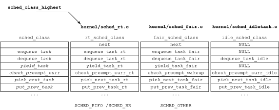

### 调度器类的顺序
* stop-task --> deadline --> real-time --> fair --> idle
* 编译时期就已决定，不能动态扩展
* 在过去，在各调度器类定义的时候通过 `next` 指针定义好了下一级调度器类
  * 遍历时，通过宏 `#define sched_class_highest (&stop_sched_class)` 将 `stop-task` 指定为优先级最高的调度器类
```cpp
#define sched_class_highest (&stop_sched_class)
#define for_each_class(class) \
   for (class = sched_class_highest; class; class = class->next)
...
const struct sched_class stop_sched_class = {
    .next           = &dl_sched_class,
    ...
}
```
* 现在调度器类的顺序则通过 `__sched_class_highest[]` 和 `__sched_class_lowest[]` 两个全局数组来标识，在 include/asm-generic/vmlinux.lds.h 就固定好了
```cpp
/*
 * The order of the sched class addresses are important, as they are
 * used to determine the order of the priority of each sched class in
 * relation to each other.
 */
#define SCHED_DATA              \
    STRUCT_ALIGN();             \
    __sched_class_highest = .;      \
    *(__stop_sched_class)           \
    *(__dl_sched_class)         \
    *(__rt_sched_class)         \
    *(__fair_sched_class)           \
    *(__idle_sched_class)           \
    __sched_class_lowest = .;
```
* kernel/sched/sched.h
```cpp
/*
 * Helper to define a sched_class instance; each one is placed in a separate
 * section which is ordered by the linker script:
 *
 *   include/asm-generic/vmlinux.lds.h
 *
 * *CAREFUL* they are laid out in *REVERSE* order!!!
 *
 * Also enforce alignment on the instance, not the type, to guarantee layout.
 */
#define DEFINE_SCHED_CLASS(name) \
const struct sched_class name##_sched_class \
    __aligned(__alignof__(struct sched_class)) \
    __section("__" #name "_sched_class")

/* Defined in include/asm-generic/vmlinux.lds.h */
extern struct sched_class __sched_class_highest[];
extern struct sched_class __sched_class_lowest[];

#define for_class_range(class, _from, _to) \
    for (class = (_from); class < (_to); class++)

#define for_each_class(class) \
    for_class_range(class, __sched_class_highest, __sched_class_lowest)

#define sched_class_above(_a, _b)   ((_a) < (_b))
```
* 这样做的目的无疑是为了“快”。较之用 `next` 指针索引，利用数组元素索引可以让编译器生成更简单的代码。因为这是调度决策时的热点路径。
* 从此比较调度器类的优先级也更简单了，比较调度器类的地址就可以了，见 `sched_class_above()` 的定义

## 调度策略
* include/uapi/linux/sched.h
```c
/*
 * Scheduling policies
 */
#define SCHED_NORMAL        0
#define SCHED_FIFO      1
#define SCHED_RR        2
#define SCHED_BATCH     3
/* SCHED_ISO: reserved but not implemented yet */
#define SCHED_IDLE      5
#define SCHED_DEADLINE      6
```
* 调度策略与调度器类是多对一的映射关系

调度器类 | 调度策略 |
---|---
fair|SCHED_NORMAL
... |SCHED_BATCH
... |SCHED_IDLE
real-time|SCHED_FIFO
... |SCHED_RR
deadline|SCHED_DEADLINE

## stop-task，idle-task 与 SCHED_IDLE

* `stop` 任务是系统中优先级最高的任务，它可以抢占所有的进程并且不会被任何进程抢占，其专属调度器类即 `stop-task`。
* `idle-task` 调度器类与 CFS 里要处理的 `SCHED_IDLE` 没有关系。
* `idle` 任务会被任意进程抢占，其专属调度器类为 `idle-task`。
* `idle-task` 和 `stop-task` 没有对应的调度策略。
* 采用 `SCHED_IDLE` 调度策略的任务其调度器类为 **CFS**。

> The stop task is the highest priority task in the system, it preempts
> everything and will be preempted by nothing.
* stop_task.c Comment

> NOTE: these are not related to SCHED_IDLE tasks which are handled in sched/fair.c
* idle_task.c Comment

> The stop_sched_class is to stop cpu, using on SMP system, for load balancing
> and cpu hotplug. This class have the highest scheduling priority.
* http://stackoverflow.com/questions/15399782/what-is-the-use-of-stop-sched-class-in-linux-kernel

> Idle is used to schedule the per-cpu idle task (also called *swapper* task)
> which is run if no other task is runnable.

## cpu_idle
* init/main.c
```c
...
/*  
 * We need to finalize in a non-__init function or else race conditions
 * between the root thread and the init thread may cause start_kernel to
 * be reaped by free_initmem before the root thread has proceeded to
 * cpu_idle.
 *      
 * gcc-3.4 accidentally inlines this function, so use noinline.
 */

static __initdata DECLARE_COMPLETION(kthreadd_done);

static noinline void __init_refok rest_init(void)
{
    int pid;

    rcu_scheduler_starting();
    /*
     * We need to spawn init first so that it obtains pid 1, however
     * the init task will end up wanting to create kthreads, which, if
     * we schedule it before we create kthreadd, will OOPS.
     */
    kernel_thread(kernel_init, NULL, CLONE_FS);
    numa_default_policy();
    pid = kernel_thread(kthreadd, NULL, CLONE_FS | CLONE_FILES);
    rcu_read_lock();
    kthreadd_task = find_task_by_pid_ns(pid, &init_pid_ns);
    rcu_read_unlock();
    complete(&kthreadd_done);

    /*
     * The boot idle thread must execute schedule()
     * at least once to get things moving:
     */
    init_idle_bootup_task(current); /*当前进程的调度器类设置为idle_sched_class*/
    schedule_preempt_disabled();
    /* Call into cpu_idle with preempt disabled */
    cpu_startup_entry(CPUHP_ONLINE);
}
...
asmlinkage __visible void __init start_kernel(void)
{
  ...
  rest_init();
}
```

* kernel/sched/idle.c
```c
/*
 * Generic idle loop implementation
 *
 * Called with polling cleared.
 */
static void cpu_idle_loop(void)
{
    while (1) {
        /*
         * If the arch has a polling bit, we maintain an invariant:
         *
         * Our polling bit is clear if we're not scheduled (i.e. if
         * rq->curr != rq->idle).  This means that, if rq->idle has
         * the polling bit set, then setting need_resched is
         * guaranteed to cause the cpu to reschedule.
         */

        __current_set_polling();
        quiet_vmstat();
        tick_nohz_idle_enter();

        while (!need_resched()) {
            check_pgt_cache();
            rmb();

            if (cpu_is_offline(smp_processor_id())) {
                cpuhp_report_idle_dead();
                arch_cpu_idle_dead();
            }

            local_irq_disable();
            arch_cpu_idle_enter();

            /*
             * In poll mode we reenable interrupts and spin.
             *
             * Also if we detected in the wakeup from idle
             * path that the tick broadcast device expired
             * for us, we don't want to go deep idle as we
             * know that the IPI is going to arrive right
             * away
             */
            if (cpu_idle_force_poll || tick_check_broadcast_expired())
                cpu_idle_poll();
            else
                cpuidle_idle_call();

            arch_cpu_idle_exit();
        }

        /*
         * Since we fell out of the loop above, we know
         * TIF_NEED_RESCHED must be set, propagate it into
         * PREEMPT_NEED_RESCHED.
         *
         * This is required because for polling idle loops we will
         * not have had an IPI to fold the state for us.
         */
        preempt_set_need_resched();
        tick_nohz_idle_exit();
        __current_clr_polling();

        /*
         * We promise to call sched_ttwu_pending and reschedule
         * if need_resched is set while polling is set.  That
         * means that clearing polling needs to be visible
         * before doing these things.
         */
        smp_mb__after_atomic();

        sched_ttwu_pending();
        schedule_preempt_disabled();
    }
}
...
void cpu_startup_entry(enum cpuhp_state state)
{
    /*  
     * This #ifdef needs to die, but it's too late in the cycle to
     * make this generic (arm and sh have never invoked the canary
     * init for the non boot cpus!). Will be fixed in 3.11
     */
#ifdef CONFIG_X86
    /*  
     * If we're the non-boot CPU, nothing set the stack canary up
     * for us. The boot CPU already has it initialized but no harm
     * in doing it again. This is a good place for updating it, as
     * we wont ever return from this function (so the invalid
     * canaries already on the stack wont ever trigger).
     */
    boot_init_stack_canary();
#endif
    arch_cpu_idle_prepare(); /*留给平台相关的代码做cpu_idle的准备工作。*/
    cpuhp_online_idle(state);
    cpu_idle_loop();
}
```

## 调度相关的数据结构

### 进程结构 task_struct
* include/linux/sched.h:: task_struct
```c
struct task_struct {
...
 int prio, static_prio, normal_prio;
 unsigned int rt_priority;
 const struct sched_class *sched_class;
 struct sched_entity se;
 struct sched_rt_entity rt;
 struct sched_dl_entity dl;
...
 unsigned int policy;
 int nr_cpus_allowed;
 cpumask_t cpus_allowed;
...
}
```
* 优先级 `prio`, `static_prio`, `normal_prio`
  * **静态优先级** `static_prio` 进程启动时的优先级，除非用 `nice` 或 `sched_setscheduler` 修改，否则进程运行期间一直保持恒定。
  * **普通优先级** `normal_prio` 基于进程静态优先级和调度策略计算出的优先级。进程 fork 时，子进程继承的是普通优先级。
  * **动态优先级** `prio` 暂时的，非持久的优先级，调度器考虑的是这个优先级。
* **实时进程优先级** `rt_priority` 值越大表示优先级越高（后面会看计算的时候用的是减法）。
* `sched_class` 指向调度器类。在 fork 的时候会根据优先级决定进程该采用哪种调度策略。
* 调度实体 `se`, `rt`, `dl`
  * 调度器调度的是 *可调度实体*，而不限于进程
  * 一组进程可以构成一个 *可调度实体*，实现 *组调度*
  * 注意：这里用的都是实体而不是指针
* `SCHED_IDLE` 进程 **不负责** 调度空闲进程。空闲进程由内核提供单独的机制来处理。

### 调度器类 sched_class
* kernel/sched/sched.h:: sched_class
```c
struct sched_class {
    const struct sched_class *next;

    void (*enqueue_task) (struct rq *rq, struct task_struct *p, int flags);
    void (*dequeue_task) (struct rq *rq, struct task_struct *p, int flags);
    void (*yield_task) (struct rq *rq);
    bool (*yield_to_task) (struct rq *rq, struct task_struct *p, bool preempt);

    void (*check_preempt_curr) (struct rq *rq, struct task_struct *p, int flags);

    /*   
     * It is the responsibility of the pick_next_task() method that will
     * return the next task to call put_prev_task() on the @prev task or
     * something equivalent.
     *
     * May return RETRY_TASK when it finds a higher prio class has runnable
     * tasks.
     */
    struct task_struct * (*pick_next_task) (struct rq *rq,
                        struct task_struct *prev);
    void (*put_prev_task) (struct rq *rq, struct task_struct *p);

    void (*set_curr_task) (struct rq *rq);
    void (*task_tick) (struct rq *rq, struct task_struct *p, int queued);
    void (*task_fork) (struct task_struct *p);
    void (*task_dead) (struct task_struct *p);
#ifdef CONFIG_SMP
...
#endif
    /*   
     * The switched_from() call is allowed to drop rq->lock, therefore we
     * cannot assume the switched_from/switched_to pair is serliazed by
     * rq->lock. They are however serialized by p->pi_lock.
     */
    void (*switched_from) (struct rq *this_rq, struct task_struct *task);
    void (*switched_to) (struct rq *this_rq, struct task_struct *task);
    void (*prio_changed) (struct rq *this_rq, struct task_struct *task,
                 int oldprio);

    unsigned int (*get_rr_interval) (struct rq *rq,
                     struct task_struct *task);

    void (*update_curr) (struct rq *rq);
#ifdef CONFIG_FAIR_GROUP_SCHED
...
#endif
```
* `next` 指向下一个调度器类。
* `enqueue_task` 向运行队列添加新进程。
* `dequeue_task` 从运行队列删除进程。
* `yield_task` 进程自愿放弃对处理器的控制权，相应的系统调用为 `sched_yield`。
* `yield_to_task` 让出处理器，并期望将控制权交给指定的进程。
* `pick_next_task` 选择下一个将要运行的进程。
* `put_prev_task` 用另外一个进程 **替换当前进程之前** 调用。
* `set_curr_task` 改变当前进程的调度策略时调用。
* `task_tick` 每次激活周期性调度器时，由周期性调度器调用。
* `task_fork` 用于建立 `fork` 系统调用和调度器之间的关联，在 `sched_fork()` 函数中被调用。
* `get_rr_interval` 返回进程的缺省时间片，对于 CFS 返回的是该调度周期内分配的实际时间片。相关系统调用为 `sched_rr_get_interval`。
* `update_curr` 更新当前进程的运行时间统计。
* `check_preempt_curr` 检查当前进程是否需要重新调度。

### 运行队列 rq
* 每个 CPU 有各自的运行队列
* 各个活动进程只出现在一个运行队列中。在多个 CPU 上运行同一个进程是不可能的
* 发源于同一进程的线程可以在不同 CPU 上执行
* **注意**：特定于调度器类的子运行队列是实体，而不是指针
* kernel/sched/sched.h:: rq
```c
/*
 * This is the main, per-CPU runqueue data structure.
   ...
 */
struct rq {
...
    unsigned int nr_running;
...
    /* capture load from *all* tasks on this cpu: */
    struct load_weight load;
    struct cfs_rq cfs;
    struct rt_rq rt;
    struct dl_rq dl;
...
    struct task_struct *curr, *idle, *stop;
...
    u64 clock;
}
```
* `nr_running` 队列上可运行进程的数目，**不考虑优先级或调度类**。
* `load` 运行队列当前的累计权重。
* `curr` 指向当前运行进程的 `task_struct` 实例。
* `idle` 指向空闲进程的 `task_struct` 实例。该进程在没有其他可运行进程时执行。
* `clock` 每个运行队列的时钟。每次周期性调度器被调用的时候会更新这个值。

#### runqueues
* 系统的所有运行队列都在 `runqueues` 数组中，该数组中的每一个元素对应于系统中的一个 CPU
* kernel/sched/core.c
```c
DEFINE_PER_CPU_SHARED_ALIGNED(struct rq, runqueues);
```
在 SMP 开启的情况下该宏展开为：
```c
__percpu __attribute__((section(".data..percpu..shared_aligned"))) \
  __typeof__(struct rq) runqueues \
  ____cacheline_aligned_in_smp;
```
关于 kernel 的 Per-CPU 变量值得用一篇文章来详叙，这里不深入讲解。
Per-CPU 相关代码见：
* include/linux/percpu-defs.h
* include/asm-generic/percpu.h
* include/linux/compiler-gcc.h
* arch/x86/kernel/setup_percpu.c
* include/asm-generic/vmlinux.lds.h

### 调度实体
不同的调度器类分别使用各自的调度实体，谈具体调度器类的时候再详细讨论。
* sched_entity
* sched_rt_entity
* sched_dl_entity

## 优先级
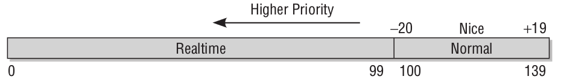

### 计算优先级
* `static_prio` 通常是优先级计算的起点
* `prio` 是调度器关心的优先级，通常由 `effective_prio()` 计算，计算时考虑当前的优先级的值
* `prio` 有可能会因为 *非实时进程* 要使用实时互斥量(RT-Mutex)而临时提高优先级至实时优先级
* `normal_prio` 通常由 `normal_prio()` 计算，计算时考虑调度策略的因素

```c
/*
 * __normal_prio - return the priority that is based on the static prio
 */
static inline int __normal_prio(struct task_struct *p)
{
    return p->static_prio;
}

/*
 * Calculate the expected normal priority: i.e. priority
 * without taking RT-inheritance into account. Might be
 * boosted by interactivity modifiers. Changes upon fork,
 * setprio syscalls, and whenever the interactivity
 * estimator recalculates.
 */
static inline int normal_prio(struct task_struct *p)
{
    int prio;
    /*基于进程静态优先级和调度策略计算优先级，不考虑优先级继承*/
    if (task_has_dl_policy(p))
        prio = MAX_DL_PRIO-1;
    else if (task_has_rt_policy(p))
        prio = MAX_RT_PRIO-1 - p->rt_priority;
    else
        prio = __normal_prio(p);
    return prio;
}

/*
 * Calculate the current priority, i.e. the priority
 * taken into account by the scheduler. This value might
 * be boosted by RT tasks, or might be boosted by
 * interactivity modifiers. Will be RT if the task got
 * RT-boosted. If not then it returns p->normal_prio.
 */
static int effective_prio(struct task_struct *p)
{
    p->normal_prio = normal_prio(p);
    /*   
     * If we are RT tasks or we were boosted to RT priority,
     * keep the priority unchanged. Otherwise, update priority
     * to the normal priority:
     */
    if (!rt_prio(p->prio))
        return p->normal_prio;
    return p->prio; /*返回继承的 RT boosted 优先级*/
}
```
* `fork` 子进程时
  * 子进程的静态优先级 `static_prio` 继承自父进程
  * 动态优先级 `prio` 设置为父进程的普通优先级 `normal_prio`。这是为了确保实时互斥量引起的优先级提高 **不会** 传递到子进程


## 创建进程

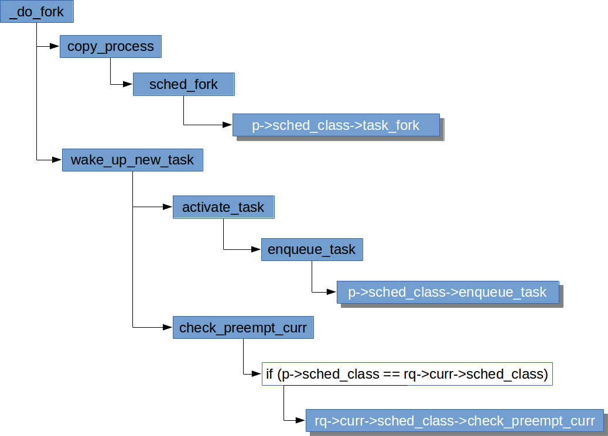

* 涉及到特定调度器类相关的工作需根据新进程使用的调度器类，委托给具体调度器类的方法处理。
* 在创建进程过程中与调度器密切相关的任务
  * 进程优先级的初始化
  * 进程放入队列
  * 检查进程是否需要调度


#### sched_fork
* kernel/sched/core.c
```c
/*
 * fork()/clone()-time setup:
 */
int sched_fork(unsigned long clone_flags, struct task_struct *p)
{
    unsigned long flags;
    int cpu = get_cpu();

    __sched_fork(clone_flags, p);
    /*   
     * We mark the process as running here. This guarantees that
     * nobody will actually run it, and a signal or other external
     * event cannot wake it up and insert it on the runqueue either.
     */
    /*这里之所以要将进程的状态置为TASK_RUNNING，是为了防止内核的其他部分试图
      将进程的状态从非运行改为运行，并且在进程的设置彻底完成之前调度进程。
     */
    p->state = TASK_RUNNING;

    /*   
     * Make sure we do not leak PI boosting priority to the child.
     */
    /* 这里就是之前提到的，确保fork后父进程提高的优先级不会泄漏到子进程 */
    p->prio = current->normal_prio;

    /*   
     * Revert to default priority/policy on fork if requested.
     */
    /* sched_reset_on_fork参数对policy和priority的影响 */
    if (unlikely(p->sched_reset_on_fork)) {
        if (task_has_dl_policy(p) || task_has_rt_policy(p)) {
            p->policy = SCHED_NORMAL;
            p->static_prio = NICE_TO_PRIO(0);
            p->rt_priority = 0;
        } else if (PRIO_TO_NICE(p->static_prio) < 0)
            p->static_prio = NICE_TO_PRIO(0);

        p->prio = p->normal_prio = __normal_prio(p);
        set_load_weight(p);

        /*   
         * We don't need the reset flag anymore after the fork. It has
         * fulfilled its duty:
         */
        p->sched_reset_on_fork = 0;
    }
    /* 根据动态优先级决定该采用哪个调度器类，这就是之前为什么说：动态优先级是调度器考虑的优先级 */
    if (dl_prio(p->prio)) {
        put_cpu();
        return -EAGAIN;
    } else if (rt_prio(p->prio)) {
        p->sched_class = &rt_sched_class;
    } else {
        p->sched_class = &fair_sched_class;
    }

    if (p->sched_class->task_fork)
        p->sched_class->task_fork(p);

    /*
     * The child is not yet in the pid-hash so no cgroup attach races,
     * and the cgroup is pinned to this child due to cgroup_fork()
     * is ran before sched_fork().
     *
     * Silence PROVE_RCU.
     */
    raw_spin_lock_irqsave(&p->pi_lock, flags);
    set_task_cpu(p, cpu);
    raw_spin_unlock_irqrestore(&p->pi_lock, flags);

...
#if defined(CONFIG_SMP)
    p->on_cpu = 0;
#endif
    init_task_preempt_count(p);
...
    put_cpu();
    return 0;
}
```

#### check_preempt_curr()
* kernel/sched/core.c
```c
void check_preempt_curr(struct rq *rq, struct task_struct *p, int flags)
{
    const struct sched_class *class;
    /*同一调度器类之间的进程是否需要被重新调度，交由该调度器类内部去决定*/
    if (p->sched_class == rq->curr->sched_class) {
        rq->curr->sched_class->check_preempt_curr(rq, p, flags);
    } else {
        /*由高到低检查不同调度器类之间的进程是否需要重新调度*/
        for_each_class(class) {
            /*低级别的调度器类的进程无法抢占高级别的调度器类的进程。
              例如rq->curr->sched_class是实时调度器类，而p->sched_class是CFS，
              则循环会在class等于&rt_sched_class时break。*/
            if (class == rq->curr->sched_class)
                break; /*队列当前任务的调度器类优先级高于检查的进程的，无法抢占，跳出循环*/
            /*反之，高级别的调度器类的进程可以抢占低级别的调度器类的进程。
              例如p->sched_class是实时调度器类，而rq->curr->sched_class是CFS，
              则循环会在class等于&rt_sched_class时设置标志位后break。*/
            if (class == p->sched_class) {
                resched_curr(rq); /*设置重新调度标志位*/
                break;
            }
        }
    }
...
}
```

## 周期性调度
* 每次周期性的时钟中断，时钟中断处理函数会地调用 `update_process_times()`
  * kernel/time/timer.c

  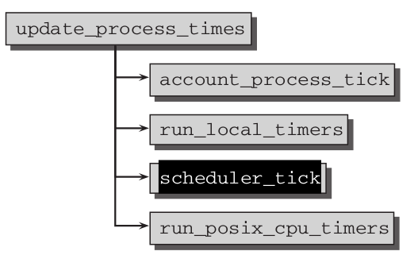

* `scheduler_tick()` 函数为周期性调度的入口，
  1. 管理内核中与整个系统和各个进程的调度相关的统计量
  2. 调用当前进程所属调度器类的周期性调度方法
  * kernel/sched/core.c
```c
/*
 * This function gets called by the timer code, with HZ frequency.
 * We call it with interrupts disabled.
 */
void scheduler_tick(void)
{
    int cpu = smp_processor_id();
    struct rq *rq = cpu_rq(cpu);
    struct task_struct *curr = rq->curr;

    sched_clock_tick();  /* 更新sched_clock_data */

    raw_spin_lock(&rq->lock);
    update_rq_clock(rq); /* 更新rq->clock */
    curr->sched_class->task_tick(rq, curr, 0); /*调用调度器类的周期性调度方法*/
...
    raw_spin_unlock(&rq->lock);
...
}
```
* 如果需要重新调度，`curr->sched_class->task_tick()` 会在 `task_struct`（更准确的说是在 `thread_info`）中设置 `TIF_NEED_RESCHED` 标志位表示请求重新调度
* 但 **并不意味着立即抢占**，仍然需要等待内核在适当的时间完成该请求（参考 [这里](http://www.linuxinternals.org/blog/2016/03/20/tif-need-resched-why-is-it-needed/)）


## 进程唤醒

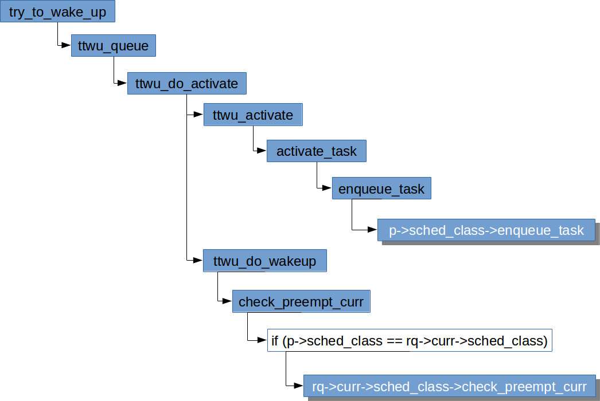

* 进程唤醒的时候，将 `enqueue_task` 和 `check_preempt_curr` 等工作 *委托* 给具体的调度器类。
* 进程唤醒过程中与调度器相关的任务
  * 进程重新放入运行队列
  * 进程是否需要重新调度


## 主调度函数 schedule()

* `__schedule()` 是主调度函数，其主要任务是：
  * 选出下一个将要调度的进程
  * 切换到要调度的进程
  * kernel/sched/core.c
```c
/*
 * __schedule() is the main scheduler function.
 *
 * The main means of driving the scheduler and thus entering this function are:
 *
 *   1. Explicit blocking: mutex, semaphore, waitqueue, etc.
 *
 *   2. TIF_NEED_RESCHED flag is checked on interrupt and userspace return
 *      paths. For example, see arch/x86/entry_64.S.
 *
 *      To drive preemption between tasks, the scheduler sets the flag in timer
 *      interrupt handler scheduler_tick().
 *
 *   3. Wakeups don't really cause entry into schedule(). They add a
 *      task to the run-queue and that's it.
 *
 *      Now, if the new task added to the run-queue preempts the current
 *      task, then the wakeup sets TIF_NEED_RESCHED and schedule() gets
 *      called on the nearest possible occasion:
 *
 *       - If the kernel is preemptible (CONFIG_PREEMPT=y):
 *
 *         - in syscall or exception context, at the next outmost
 *           preempt_enable(). (this might be as soon as the wake_up()'s
 *           spin_unlock()!)
 *
 *         - in IRQ context, return from interrupt-handler to
 *           preemptible context
 *
 *       - If the kernel is not preemptible (CONFIG_PREEMPT is not set)
 *         then at the next:
 *
 *          - cond_resched() call
 *          - explicit schedule() call
 *          - return from syscall or exception to user-space
 *          - return from interrupt-handler to user-space
 *
 * WARNING: must be called with preemption disabled!
 */
 static void __sched notrace __schedule(bool preempt)
 {
     struct task_struct *prev, *next;
     unsigned long *switch_count;
     struct rq *rq;
     int cpu;

     cpu = smp_processor_id();
     rq = cpu_rq(cpu);
     prev = rq->curr;
     ...
     local_irq_disable();
     ...
     raw_spin_lock(&rq->lock);
     lockdep_pin_lock(&rq->lock);

     rq->clock_skip_update <<= 1; /* promote REQ to ACT */

     switch_count = &prev->nivcsw;
     if (!preempt && prev->state) {
         /* 如果不是内核抢占，且进程状态不是TASK_RUNNING，比如说因为要睡眠而被调度出去 */
         if (unlikely(signal_pending_state(prev->state, prev))) {
           /* 当前进程原来处于可中断睡眠状态，现在接收到信号，则需提升为运行进程 */
           prev->state = TASK_RUNNING;
         } else {
           /* 否则委托相应调度器类的方法停止进程的活动 */
           deactivate_task(rq, prev, DEQUEUE_SLEEP);
           prev->on_rq = 0;
           ...
         }
         switch_count = &prev->nvcsw;
     }
     /* 反之，如果是因为发生了内核抢占而调用__schedule()，则无需停止当前进程的活动，
      * 这样是为了确保能尽快选择下一个进程。如果此时一个高优先级进程在等待调度，则调度器类
      * 会选择该进程，使其运行。
      */

     /* 更新就绪队列的时钟 */
     /* 这里会根据rq->clock_skip_update决定要不要更新时钟，如果是RQCF_ACT_SKIP则不更新。
      * 通常在yeild_task的时候会将rq->clock_skip_update置为RQCF_REQ_SKIP,
      * 这样，在上面将rq->clock_skip_update移位的操作会使其变为RQCF_ACT_SKIP。
      */
     if (task_on_rq_queued(prev))
         update_rq_clock(rq);
     /* 调度最重要的任务 - 选出下一个要执行的进程 */
     next = pick_next_task(rq, prev);
     clear_tsk_need_resched(prev); /* 清除重新调度标志TIF_NEED_RESCHED */
     clear_preempt_need_resched(); /* 抢占计数器清零 */
     rq->clock_skip_update = 0;

     if (likely(prev != next)) {
         /* 选择了一个新的进程 */
         rq->nr_switches++;
         rq->curr = next;
         ++*switch_count;

         trace_sched_switch(preempt, prev, next);
         /* 执行硬件级的进程切换 */
         rq = context_switch(rq, prev, next); /* unlocks the rq */
     } else {
         /*仍然是当前进程，最常见的情况是当前队列其他进程都在睡，只有一个进程能运行*/
         lockdep_unpin_lock(&rq->lock);
         raw_spin_unlock_irq(&rq->lock);
     }
     /* 调用做负载均衡时添加到列表里的回调 */
     balance_callback(rq);
}
```
* 调完 `__schedule()` 后，都需要重新调用 `need_resched()` 检查 `TIF_NEED_RESCHED` 标志看是否需要重新调度。
* `context_switch()` 调用特定于体系结构的方法，由后者负责执行底层的上下文切换。
* 上下文切换通过调用两个特定于处理器的函数完成：
  * **switch_mm**： 更换通过 `task_struct->mm` 描述的内存管理单元。
  * **switch_to**： 切换处理器寄存器内容和内核栈。
  * **惰性 FPU 模式** (Lazy FPU mode)

### 选择下一个进程
* `pick_next_task()` 完成选择下一个进程的工作
  * kernel/sched/core.c:: pick_next_task
```c
/*
 * Pick up the highest-prio task:
 */
static inline struct task_struct *
pick_next_task(struct rq *rq, struct task_struct *prev)
{
    const struct sched_class *class = &fair_sched_class;
    struct task_struct *p;

    /*
     * Optimization: we know that if all tasks are in
     * the fair class we can call that function directly:
     */
    if (likely(prev->sched_class == class &&
           rq->nr_running == rq->cfs.h_nr_running)) {
        p = fair_sched_class.pick_next_task(rq, prev);
        if (unlikely(p == RETRY_TASK))
            goto again;

        /* assumes fair_sched_class->next == idle_sched_class */
        if (unlikely(!p))
            p = idle_sched_class.pick_next_task(rq, prev);

        return p;
    }

again:
    for_each_class(class) {
        p = class->pick_next_task(rq, prev);
        if (p) {
            if (unlikely(p == RETRY_TASK))
                goto again;
            return p;
        }
    }
    /*当所有调度器类都选不出可运行的进程时，会运行idle task，并且总是一个可运行的任务*/
    BUG(); /* the idle class will always have a runnable task */
}
```

* `pick_next_task()` 对所有进程都是 CFS class 的情况做了些优化
* 主要工作还是 *委托* 给各调度器类去完成

# 参考资料
* [O(n)  O(1) 和 CFS 调度器](http://www.wowotech.net/process_management/scheduler-history.html) *
* Linux Kernel Development (3rd Edition), Robert Love
* Professional Linux Kernel Architecture, Wolfgang Mauerer
* https://en.wikipedia.org/wiki/Scheduling_%28computing%29
* https://en.wikipedia.org/wiki/O(n)%5fscheduler
* https://en.wikipedia.org/wiki/O(1)%5fscheduler
* https://en.wikipedia.org/wiki/Completely_Fair_Scheduler
* https://en.wikipedia.org/wiki/Brain_Fuck_Scheduler
* https://en.wikipedia.org/wiki/Strategy_pattern
* https://sourcemaking.com/design_patterns/strategy
* http://www.ibm.com/developerworks/cn/linux/l-cn-scheduler/index.html
* [TIF_NEED_RESCHED: Why Is It Needed](http://www.linuxinternals.org/blog/2016/03/20/tif-need-resched-why-is-it-needed/)
* [What Does an Idle CPU Do?](http://duartes.org/gustavo/blog/post/what-does-an-idle-cpu-do/)
- [LWN：Linux 新的 EEVDF 调度器！](https://mp.weixin.qq.com/s/MqAzzGU8JCV90wUUWUJbyQ)
- [An EEVDF CPU scheduler for Linux](https://lwn.net/Articles/925371/)
